# Harnessing AI for the Real Economy / 驾驭人工智能，赋能实体经济

Goldman Sachs Investment Banking / 高盛投资银行

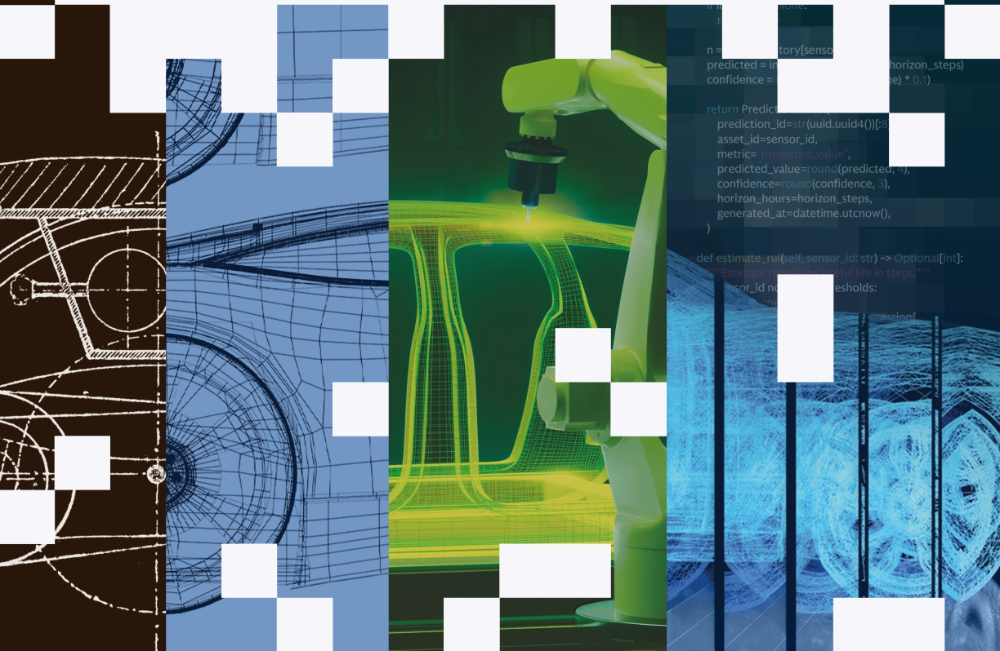

## A Letter from Dan Dees / 丹·迪斯来信

**Dan Dees | Co-Head of Global Banking and Markets / 丹·迪斯｜全球银行与市场联席主管**

### The AI era is driving industrial transformation unlike any in modern history—faster, broader, and more capital-intensive, creating new infrastructure and industry simultaneously. / 人工智能时代正推动一场现代史上前所未有的工业变革——速度更快、范围更广、资本密集度更高，并同时创造新的基础设施与产业。

Most of the capital that will define the AI economy has not yet been deployed, most of the infrastructure has not yet been built, and most of the M&A that will shape the competitive landscape has not yet been executed. Hyperscalers alone are projected to invest more than $6 trillion in AI through 2030—many times the capital deployed to internet infrastructure during the dotcom era. Funding a buildout of this scale, an estimated $7 trillion+ between 2026 and 2031 across compute, power, and data centers, will require the full capital stack: equity, public and private debt, sovereign capital, and new joint-venture structures, some of which have yet to be invented.' 1. Even at that scale, US AI investment equals only about 1.2% of today's annual GDP.2 And while it will rise further if current projections are realized, even the most optimistic scenarios suggest it will remain well below the railroad buildouts of the 1800s, which ran 3% to 4.5%.

定义人工智能经济的大部分资本尚未部署，大部分基础设施尚未建成，而塑造竞争格局的大部分并购也尚未实施。预计仅超大规模云服务商到 2030 年就将在人工智能领域投资超过 6 万亿美元——是互联网泡沫时代互联网基础设施投入资本的数倍。为如此规模的建设提供资金——预计 2026 至 2031 年间，算力、电力和数据中心合计超过 7 万亿美元——需要动用完整的资本栈：股权、公开与私人债务、主权资本以及一些尚待发明的新型合资结构。¹ 即便达到这一规模，美国人工智能投资也仅相当于当前年度 GDP 的约 1.2%。² 如果当前预测成为现实，这一比例还会进一步上升，但即使最乐观的情景也表明，它仍将远低于 19 世纪铁路建设占 GDP 3% 至 4.5% 的水平。

In Powering the AI Era (2025), we examined the infrastructure buildout and the financing innovations meeting that demand. This report addresses what comes next: the industrial reorganization unfolding across the real economy, the capital pools being assembled to fund it, and the gap between today's digital-infrastructure financing and the demands of physical AI at scale.

在《为人工智能时代供能》（2025）中，我们研究了基础设施建设以及满足相关需求的融资创新。本报告聚焦下一阶段：实体经济中正在展开的产业重组、为其筹资而汇集的资本池，以及当今数字基础设施融资与大规模实体人工智能需求之间的差距。

The pattern has precedent. George Westinghouse founded his electric company in 1886 at the center of the last great energy transition. Today, the company is at the forefront of the energy transition that will define what comes next—accelerating the buildout of large-scale nuclear power generation to help meet growing energy demand and support energy security in the United States. Siemens, founded in 1847 around the telegraph, is now a leader in defining the future of industrial AI. Businesses endure across such transformations by embracing new technologies and reinventing their strategic playbooks and capital structures in response.

这种模式并非没有先例。乔治·威斯汀豪斯于 1886 年在上一轮重大能源转型的中心创办了电气公司。如今，该公司站在决定未来走向的能源转型前沿——加快建设大规模核电，以帮助满足不断增长的能源需求并保障美国能源安全。西门子于 1847 年围绕电报业务创立，如今已成为定义工业人工智能未来的领导者。企业之所以能够跨越此类变革长期生存，是因为它们拥抱新技术，并相应重塑战略打法与资本结构。

The companies emerging alongside them are building their technology and capital architecture simultaneously: AI labs growing at multibillion-dollar revenue numbers, physical AI and robotics firms drawing capital at software-startup velocity, defense challengers reshaping incumbents, space ventures reaching the public markets at unprecedented scale, and new companies building AI for engineering and manufacturing itself.

与它们一同崛起的企业正在同步构建技术与资本架构：人工智能实验室的收入增长至数十亿美元规模；实体人工智能与机器人公司以软件初创企业般的速度吸引资本；国防挑战者重塑传统巨头；太空企业以前所未有的规模进入公开市场；还有新公司专门为工程与制造本身打造人工智能。

Goldman Sachs has partnered with the companies behind every major industrial transformation for over 150 years. We continue to connect innovators with capital, industry expertise, and strategic guidance as they navigate the transformation happening today. And it feels like we're just getting started.

150 多年来，高盛一直与推动历次重大工业变革的企业合作。面对当今正在发生的转型，我们继续为创新者连接资本、行业专长与战略指导。而这一切仿佛才刚刚开始。

**Dan Dees / 丹·迪斯**

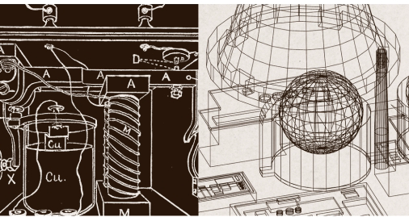

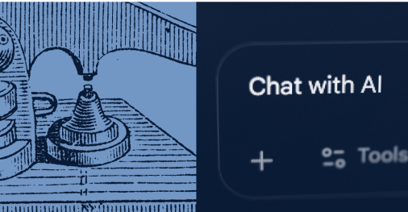

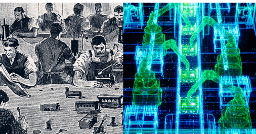

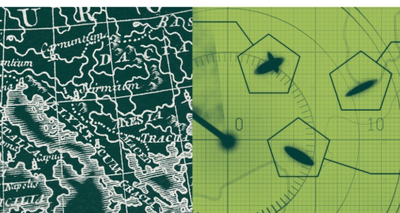

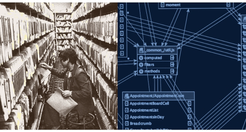

# Contents / 目录

- **A Convergence Unlike Any Before: How AI Is Reshaping the Real Economy / 前所未有的汇流：人工智能如何重塑实体经济** · p.3
- **The New Industrial Economy: Where AI Meets the Real World / 新工业经济：人工智能与现实世界交汇之处** · p.8
- **Capital Architecture: Financing the Next Phase of Expansion / 资本架构：为下一阶段扩张融资** · p.22
- **Global Investment Banking Leadership and Contributors / 全球投资银行领导团队与贡献者** · p.31

# SECTION 01 · A Convergence Unlike Any Before: How AI Is Reshaping the Real Economy / 第 01 节 · 前所未有的汇流：人工智能如何重塑实体经济

Every major technology transition has followed a familiar sequence: infrastructure built first, applications developed on top, and capital structures adapting along the way. The AI economy has broken that formula, reshaping the real economy at a pace no prior transition has matched. To win in this era, leaders will need incisive capital strategy as much as the technology itself.

每一次重大技术转型都遵循熟悉的顺序：先建设基础设施，再在其上开发应用，资本结构随之调整。人工智能经济打破了这一模式，正以前所未有的速度重塑实体经济。要在这个时代取胜，领导者既需要技术本身，也需要敏锐有力的资本战略。

## Prior revolutions began not when the tools arrived, but when the capital caught up to scale them. The current transition is being enabled by the last—with AI's compute demand pulling the next wave of energy buildout behind it. / 以往革命并非始于工具问世，而是始于资本跟进并推动其规模化。当前转型由上一轮革命奠定基础——人工智能的算力需求正牵引下一波能源建设。

Our 2025 Powering the AI Era report sized the infrastructure opportunity at $5 trillion over the next decade³—more than electrification and the internet buildout combined.⁴ But a second transformative layer is converging as AI is remaking industrial operations and markets—reshaping the real economy as a whole.

我们在 2025 年发布的《为人工智能时代供能》报告中估算，未来十年的基础设施机遇规模为 5 万亿美元³——超过电气化与互联网建设的总和。⁴ 然而，随着人工智能重塑工业运营与市场，第二个变革层也正在汇流——从整体上重塑实体经济。

## Parallel Shifts / 并行转变

### Most of the buildout required to power the AI economy is still underway, yet AI disruption is outpacing those foundations. / 为人工智能经济供能所需的大部分建设仍在进行，但人工智能带来的颠覆速度已超过这些基础设施的建设速度。

Global hyperscaler CapEx is projected to reach over $760 billion in 2026 (approximately $2 billion per day). Global data center supply grew from 30 gigawatts in 2019 to 57 gigawatts in 2024, with another 65 gigawatts projected online by 2030.⁵ The capital is moving simultaneously across geographies: US hyperscalers lead the headline figures, but Middle East sovereign wealth funds, European industrial investment in domestic AI capacity, and Asian capital deployment around regional supply chains are now structural components of the global buildout. In June 2026, Google agreed to pay SpaceX roughly $920 million a month—about $30 billion through mid-2029—for access to approximately 110,000 Nvidia GPUs, a sign that compute demand now outruns what even the largest owners of AI compute can build on their own timelines.⁶ Grid operators are prioritizing interconnection requests with energy requirements that didn't appear in any planning model three years ago, and most electrical distribution equipment carries multiyear backlogs at every major manufacturer. The mismatch arrives unevenly across sectors—first where market cycles run shortest.

预计 2026 年全球超大规模云服务商的资本支出将超过 7,600 亿美元（每天约 20 亿美元）。全球数据中心供应从 2019 年的 30 吉瓦增至 2024 年的 57 吉瓦，预计到 2030 年还将新增 65 吉瓦并投入运行。⁵ 资本正同时跨地域流动：美国超大规模云服务商占据头条数字，但中东主权财富基金、欧洲对本土人工智能能力的工业投资，以及亚洲围绕区域供应链的资本部署，如今都已成为全球建设的结构性组成部分。2026 年 6 月，谷歌同意每月向 SpaceX 支付约 9.2 亿美元——截至 2029 年年中总计约 300 亿美元——以使用约 11 万块英伟达 GPU；这表明算力需求的增长速度，已经超过即便最大的人工智能算力拥有者按自身时间表所能建设的速度。⁶ 电网运营商正在优先处理三年前任何规划模型中都未出现过的高能耗并网申请，而各大制造商的大多数配电设备订单都积压数年。这种错配在各行业中并非均匀出现，而是首先出现在市场周期最短的领域。

For now, software represents the first major signal, and physical AI is where it lands. Today, SaaS accounts for less than 0.5% of global GDP. The real economy—the other ≈99.5% of the global economy that AI has barely touched, from manufacturing and robotics to defense, construction, and energy—defines the actual scale of opportunity.7 In 2025, industry labs shipped approximately 90 notable AI model releases—more than double the 2023 count—and the pace has accelerated further into 2026.⁸ What began as disruption within software will spread across every sector of the economy as intelligence becomes deeply embedded in products, workflows, and decision-making.

目前，软件是第一个重大信号，而实体人工智能则是其落地之处。如今，SaaS 占全球 GDP 的比例不到 0.5%。实体经济——即人工智能几乎尚未触及的全球经济其余约 99.5%，从制造、机器人到国防、建筑和能源——界定了机会的真实规模。⁷ 2025 年，行业实验室发布了约 90 个重要人工智能模型，是 2023 年数量的两倍多；进入 2026 年后，这一速度进一步加快。⁸ 随着智能深度嵌入产品、工作流与决策，始于软件内部的颠覆将扩展到经济的每一个行业。

The industrial economy is already deploying AI at scale. Siemens runs AI-driven predictive maintenance at its Amberg electronics plant in Germany, achieving a 40% reduction in production downtime.⁹
Figure AI's humanoid robots ran 10-hour daily shifts for 5+ months on BMW's body shop line in Spartanburg, South Carolina, contributing to the production of more than 30,000 vehicles across roughly 1,250 operating hours.¹⁰ These are clear signs of an industrial paradigm being rebuilt around AI.

工业经济已在规模化部署人工智能。西门子在德国安贝格电子工厂运行人工智能驱动的预测性维护，使生产停机时间减少了 40%。⁹
Figure AI 的人形机器人在南卡罗来纳州斯帕坦堡的宝马车身车间生产线上连续 5 个多月每天工作 10 小时，累计运行约 1,250 小时，参与生产了 3 万多辆汽车。¹⁰ 这些都是工业范式正围绕人工智能重建的明确信号。

### The real AI opportunity is the other ≈99.5% / 人工智能真正的机会在其余约 99.5%

<table>
<tr><td><strong>TOTAL ECONOMY / 整体经济</strong> <strong>$100tn+</strong> Global GDP¹¹ 全球 GDP¹¹</td><td><strong>TECHNOLOGY SECTOR / 科技行业</strong> <strong>≈$5tn+</strong> ≈5% of global GDP¹² 约占全球 GDP 的 5%¹²</td><td><strong>SaaS / 软件即服务</strong> <strong>&lt;$500bn</strong> ≈0.5% of global GDP¹³ 约占全球 GDP 的 0.5%¹³</td></tr>
</table>

> “We’re experiencing unique parallel moments unfolding in real time—building the infrastructure required to advance AI, while AI is rewriting the rules of the global economy.”
>
> “我们正在亲历独特的并行时刻——一边建设推动人工智能发展所需的基础设施，一边见证人工智能重写全球经济规则。”
>
> **Mark Sorrell | Global Head of the Industrials Group in Investment Banking**
>
> **马克·索雷尔｜投资银行工业组全球主管**

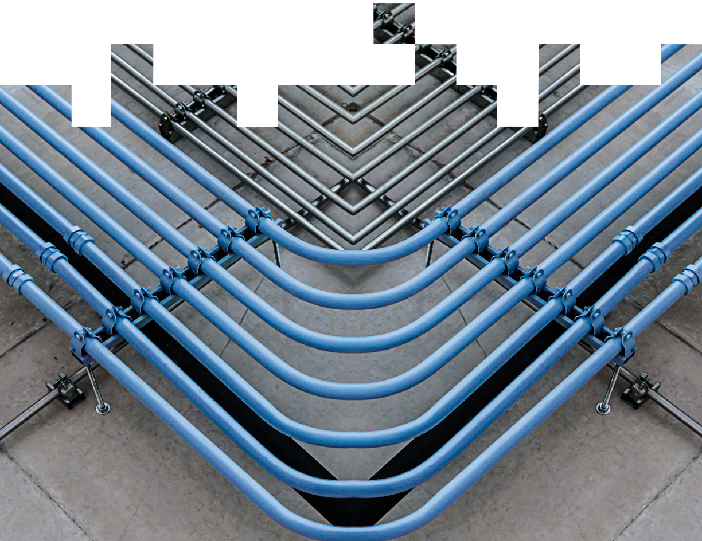

## Baseline aggregate AI CapEx estimates / 人工智能资本支出基准总额估算

> [!stat] **≈$7.6tn of capital between 2026 and 2031 across compute, data centers, and power**
> **2026 至 2031 年间用于算力、数据中心和电力的资本约 7.6 万亿美元**

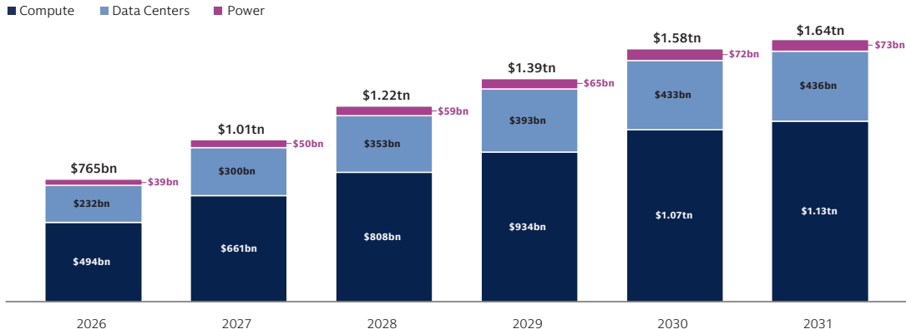

Source: Goldman Sachs Global Institute.¹⁴ / 来源：高盛全球研究院。¹⁴

## Capital at Stake / 攸关资本

Existing capital architectures were designed for sequential buildouts, not parallel demand. Traditional instruments—investment-grade corporate bonds, syndicated bank lending, project finance—cannot, on their own, simultaneously fund digital infrastructure and AI deployment across industries, exceeding what any single category of capital can efficiently provide.

现有资本架构是为顺序建设而设计的，而非为并行需求而设计。传统工具——投资级公司债券、银团贷款和项目融资——无法独自同时为数字基础设施及人工智能在各行业的部署提供资金，因为其规模超出了任何单一资本类别能够高效承载的范围。

New instruments are emerging. Private credit facilities now finance individual data center campuses exceeding one gigawatt—Vantage's 1.4 gigawatt Texas campus, financed in 2025, anchors the largest data center construction financing on record at over $25 billion.¹⁵ Sovereign wealth funds and pension funds have moved from passive allocators to direct co-investors up and down the entire infrastructure stack. Securitization of stabilized data center cash flows through Asset-Backed-Securities (ABS) and Commercial Mortgage-Backed Securities (CMBS) is established; IG capital markets are now financing data centers still in development, with institutional investors taking construction risk on AI-era buildouts at a scale that did not exist three years ago.

新工具正在涌现。私募信贷工具如今可为单个超过 1 吉瓦的数据中心园区融资——Vantage 位于得克萨斯州的 1.4 吉瓦园区于 2025 年获得融资，支撑了有史以来规模最大的数据中心建设融资，金额超过 250 亿美元。¹⁵ 主权财富基金和养老基金已从被动资产配置者转变为基础设施全栈各环节的直接共同投资者。通过资产支持证券（ABS）和商业抵押贷款支持证券（CMBS）将稳定的数据中心现金流证券化，已经形成成熟做法；投资级资本市场如今开始为仍在开发中的数据中心融资，机构投资者承担人工智能时代建设项目的施工风险，其规模在三年前尚不存在。

No one can predict with precision how the next decade unfolds. The headline figure rests on four supply-side assumptions the Goldman Sachs Global Institute identifies as setting the scale: the economic useful life of AI silicon, the cost and complexity of next-generation data centers, the chip and architecture mix, and elongation from power, labor, and equipment bottlenecks. Models will improve in ways that cannot be fully anticipated, infrastructure will build out faster or slower than current projections suggest, and geopolitical forces shaping capital flows will introduce surprises no framework fully accounts for. Today's sizing assumes existing model architectures will define tomorrow's compute demand—a reasonable base case, but if world models scale alongside language models rather than replacing them, the actual total may prove undersized.

没有人能够精确预测未来十年的演进。上述总体数字建立在高盛全球研究院认定会决定规模的四项供给侧假设之上：人工智能芯片的经济使用寿命、下一代数据中心的成本与复杂度、芯片和架构组合，以及电力、劳动力和设备瓶颈造成的工期延长。模型将以无法完全预见的方式改进，基础设施建设速度可能快于或慢于当前预测，而塑造资本流动的地缘政治力量也会带来任何框架都无法充分计入的意外。当前规模估算假设现有模型架构将决定未来算力需求——这是合理的基准情景；但如果世界模型与语言模型同步扩展而非取代后者，实际总额可能高于当前估算。

> “This transition has no direct historical precedent and demands a different kind of institutional expertise to navigate.”
>
> “这场转型没有直接的历史先例，需要不同类型的机构专业能力来驾驭。”
>
> **Pete Lyon | Global Co-Head of the Capital Solutions Group**
>
> **皮特·莱昂｜资本解决方案集团全球联席主管**

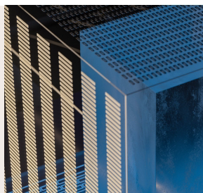

# SECTION 02 · The New Industrial Economy: Where AI Meets the Real World / 第 02 节 · 新工业经济：人工智能与现实世界交汇之处

With the digital infrastructure buildout underway, Al's next phase moves into the real economy—the manufacturing, construction, energy, and operational systems it has barely begun to reach. The instruments that finance digital infrastructure are mature; their equivalents for physical AI are not. How quickly that gap closes, sector by sector, will separate what compounds from what stalls.

随着数字基础设施建设展开，人工智能的下一阶段将进入实体经济——制造、建筑、能源以及它才刚刚开始触及的运营系统。为数字基础设施融资的工具已经成熟；实体人工智能的对应工具则尚未成熟。各行业弥合这一差距的速度，将决定哪些领域能够持续复利增长，哪些领域会停滞不前。

## I. Software: The First Domain and Enterprise Shock / 一、软件：首个阵地与企业冲击

Goldman Sachs Global Investment Research estimates AI will expand the total addressable market for automation and enterprise software by roughly 2.5x over the next decade as agentic capabilities extend software's reach into work that was previously human-only.¹⁶ The repricing underway today is happening inside a category that is structurally getting larger, not smaller. The question for incumbents is not survival, but positioning.

高盛全球投资研究估计，随着智能体能力将软件的触角延伸到过去只能由人完成的工作，未来十年人工智能将使自动化和企业软件的潜在市场总规模扩大约 2.5 倍。¹⁶ 当前的重新定价发生在一个结构性扩张而非收缩的类别中。传统企业面临的问题不是能否生存，而是如何定位。

AI is now rapidly disrupting software itself, driven by AI-automated code generation and agentic workflows. Unlike the cloud transition, where category leaders provided a clear migration template, the AI transition does not yet offer an established playbook. Few publicly listed software companies have demonstrated a fully AI-native business model at scale. The market does not yet have complete visibility into which incumbents will refound themselves first, and the repricing has been significant.

在人工智能自动代码生成和智能体工作流的推动下，人工智能如今正迅速颠覆软件本身。云转型期间，品类领导者提供了清晰的迁移模板；相比之下，人工智能转型尚无成熟打法。很少有上市软件公司已经大规模证明完全由人工智能原生驱动的商业模式。市场尚无法清楚判断哪些传统企业会率先重塑自身，因此重新定价幅度显著。

The iShares Expanded Tech-Software Sector ETF declined approximately 17% in 2026 through June, and about 26% from its October 2025 high, with the sector's 10 largest holdings shedding nearly $800 billion in market capitalization over the same span. Forward P/E multiples compressed from roughly 35x in late 2025 to about 22x, the lowest level since 2014.¹⁷ Regardless of the underlying fundamentals, that uncertainty has driven capital out of enterprise software and into the infrastructure that sits beneath it.

截至 2026 年 6 月，iShares 扩展科技软件行业 ETF 年内下跌约 17%，较 2025 年 10 月高点下跌约 26%；同期，该行业十大持仓的市值缩水近 8,000 亿美元。预期市盈率倍数从 2025 年末的约 35 倍压缩至约 22 倍，为 2014 年以来最低水平。¹⁷ 无论基础基本面如何，这种不确定性都推动资本流出企业软件，转向其底层基础设施。

That said, the companies reading this moment as a refunding rather than a threat are pulling ahead. They ship AI capabilities native to their workflows, disrupt their own product economics deliberately, and build toward the emerging value hierarchy rather than defending the existing one.

尽管如此，将这一时刻视为重建根基而非威胁的公司正在领先。它们推出原生嵌入工作流的人工智能能力，有意识地颠覆自身产品经济性，并面向新兴价值层级进行建设，而不是固守现有层级。

> “Software is the canary in the coal mine for AI economics—where AI's impact on productivity, pricing, and margin structure is appearing first.”
>
> “软件是人工智能经济的煤矿金丝雀——人工智能对生产率、定价和利润率结构的影响最先在这里显现。”
>
> **Brian Cayne | Co-Head of Software Investment Banking**
>
> **布赖恩·凯恩｜软件投资银行联席主管**

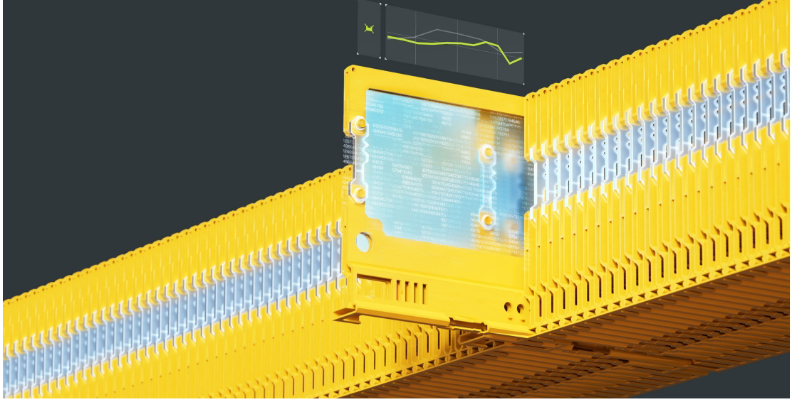

## Pricing Power Migrates / 定价权迁移

In the SaaS era, the application layer commanded the premium. Systems organized data, standardized workflows, and monetized access via seats. Pricing power sat with the application layer, which owned the customer relationship. That legacy architecture no longer holds.

在 SaaS 时代，应用层享有溢价。系统组织数据、标准化工作流，并通过席位许可将访问权变现。定价权掌握在拥有客户关系的应用层手中。如今，这种传统架构已不再成立。

Today, premium is migrating toward an outcome-driven architecture, organized around three control points. The outcome layer evaluates software by completed work rather than feature breadth or seat count. The orchestration and agent layer functions as the operating system for enterprise action, governing how work routes and where reliability is maintained. Underpinning both, the data and context layer determines whether AI becomes generic or indispensable: proprietary workflow history and institutional knowledge carry the differentiation as models become commoditized. Training and inference are splitting into different economic categories. Training is the upfront capital event, while inference is the operating cost—running continuously across every user interaction—and where AI economics ultimately resolve. It is also where the US-China cost divide is most visible: Chinese models serve inference at a fraction of US frontier pricing, and the gap has been widening. State-backed providers can price toward cost, where private capital must price to recoup it.

如今，溢价正迁移至以结果为导向、围绕三个控制点组织的架构。结果层按完成的工作而非功能广度或席位数量评价软件。编排与智能体层充当企业行动的操作系统，管理工作如何路由以及可靠性在哪里得到保障。支撑两者的数据与上下文层决定人工智能会变得通用还是不可或缺：随着模型商品化，专有工作流历史和机构知识承载差异化。训练与推理正分化为不同的经济类别。训练是前期资本事件，而推理是贯穿每次用户交互、持续发生的运营成本，也是人工智能经济性最终兑现之处。中美成本差异在这里也最为明显：中国模型以美国前沿模型定价的一小部分提供推理服务，而且差距还在扩大。国家支持的提供商可以按接近成本的水平定价，而私人资本必须按能够收回投资的水平定价。

### The China Cost Divide / 中美成本鸿沟

The model layer itself is no longer a single-geography story. Alongside the US labs anchoring most enterprise deployments, Chinese developers have also pushed the frontier's edge. Established platforms such as Alibaba, ByteDance, Tencent, Baidu, and Xiaomi have emerged alongside focused labs DeepSeek, Moonshot, MiniMax, and Zhipu. Several open-weight models now rank at or near the top of global open-model leaders, served at a fraction of the per-token cost. Because inference is where AI economics ultimately resolve, that cost structure bears directly on how the buildout's compute demand—and capital—get priced.¹⁸

模型层本身已不再是单一地域的故事。除支撑大多数企业部署的美国实验室外，中国开发者也在推进前沿。阿里巴巴、字节跳动、腾讯、百度和小米等成熟平台，与 DeepSeek、月之暗面、MiniMax 和智谱等专注型实验室共同崛起。若干开放权重模型如今位居或接近全球开放模型领先榜首，而每个 token 的服务成本仅为其他领先模型的一小部分。由于推理是人工智能经济性最终兑现之处，这种成本结构直接影响基础设施建设所需算力与资本的定价。¹⁸

By OpenRouter's tracking, Chinese models' share of token consumption on its platform has climbed from low single digits in late 2024 to roughly half by early 2026.¹⁹ But token volume does not necessarily equate to revenue—as the model layer commoditizes, value migrates up to the data and outcome layers—where the economics concentrate.

根据 OpenRouter 的追踪，中国模型在其平台 token 消耗中的份额已从 2024 年末的低个位数升至 2026 年初的约一半。¹⁹ 但 token 数量并不一定等同于收入——随着模型层商品化，价值向数据层和结果层上移，经济收益也在那里集中。

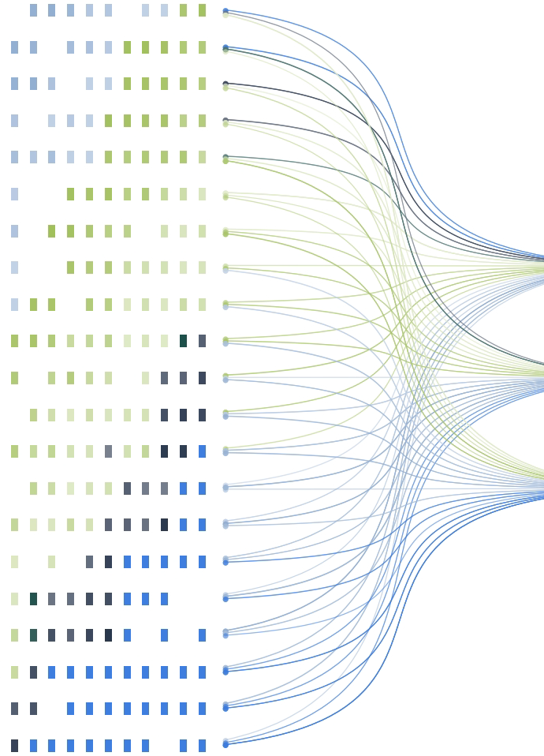

## Cybersecurity as Connective Tissue / 网络安全成为连接组织

Security has expanded with every computing infrastructure shift—from disconnected systems to the internet, from on-premise to SaaS, and now to AI. Each transition made the “attack surface” broader and the consequences of failure larger, and produced security leaders built specifically for the new architecture. The AI shift is the most expansionary yet. Enterprises must move proprietary data and operational context out of their own environments and into external models, reversing decades of effort to keep that data inside the company’s own systems. This shift makes security a precondition for AI deployment rather than a cost line within it, and the market is pricing it accordingly.

安全的边界随着每一次计算基础设施转型而扩展——从孤立系统到互联网，从本地部署到 SaaS，再到如今的人工智能。每次转型都扩大了“攻击面”，加重了失败后果，并催生了专为新架构打造的安全领导者。人工智能转型是迄今扩张幅度最大的一次。企业必须将专有数据和运营上下文移出自身环境并输入外部模型，这逆转了数十年来将数据保留在公司自身系统内的努力。这一变化使安全从人工智能部署中的一项成本，变为部署的先决条件，市场也正据此定价。

The pattern that defined cloud security a decade ago is now visible in AI security at compressed speed. The companies that will dominate AI security in the 2030s are being founded now. For institutions positioning around the AI economy, cybersecurity is not just a vertical; it has become the connective tissue for deployment.

十年前定义云安全的模式，如今正以压缩后的速度在人工智能安全领域重现。将在 2030 年代主导人工智能安全的公司正在当下创立。对于围绕人工智能经济布局的机构而言，网络安全不仅是一个垂直行业，更已成为部署的连接组织。

## II. The Industrial AI Software Layer / 二、工业人工智能软件层

A parallel restructuring is underway in industrial AI software, the operational layer where incumbents are embedding AI into the tools that design, simulate, and run physical operations. It is less visible than the software sell-off, but the scale is greater, as the overlay is not sector-specific.

工业人工智能软件领域正发生并行重组。在这一运营层，传统企业将人工智能嵌入用于设计、模拟和运行实体运营的工具。它不如软件抛售引人注目，但规模更大，因为这一覆盖层并不局限于特定行业。

Crucially, this layer is enabling a constant feedback loop where the work product itself (e.g. a car in production) communicates real-time material properties back to the machinery. This enables quality control, design, and process adjustments simultaneously to reduce cost and optimize output.

关键在于，这一层正在实现持续反馈回路：工作产品本身（例如生产中的汽车）将实时材料属性反馈给机器。这使质量控制、设计和流程调整能够同步进行，从而降低成本并优化产出。

<table>
<tr><td><strong>Manufacturing / 制造</strong> Manufacturing operators are moving from scheduled maintenance to predictive. 制造运营商正从定期维护转向预测性维护。</td><td><strong>Automotive / 汽车</strong> Automotive engineers,rain autonomous vehicle models on synthetic data from digital twins. 汽车工程师使用数字孪生生成的合成数据训练自动驾驶汽车模型。（原文 “rain” 疑为 “train” 的 OCR 错误。）</td><td><strong>Life sciences / 生命科学</strong> Life sciences are compressing drug discovery and virtualizing trial design. 生命科学正在缩短药物发现周期，并将试验设计虚拟化。</td></tr>
<tr><td><strong>Energy / 能源</strong> Energy utilities forecast load and optimize grid dispatch. 能源公用事业公司预测负荷并优化电网调度。</td><td colspan="2"><strong>Aerospace / 航空航天</strong> Aerospace integrates design, testing, and manufacturing into continuous platforms. 航空航天业将设计、测试和制造整合到连续平台中。</td></tr>
</table>

Some of the most consequential platforms are Al-native rather than acquired. Palantir's Foundry has deployed across manufacturing at Airbus, energy at BP, and defense for the US Army's Project TITAN. The category is now standalone, not just an incumbent acquisition target. Major industrial players have spent more than $110 billion acquiring software companies in this space since 2020, and the pace is accelerating.²⁰

一些最具影响力的平台并非通过收购获得，而是人工智能原生平台。Palantir 的 Foundry 已部署于空客的制造业务、BP 的能源业务以及美国陆军的 TITAN 项目国防业务。这一类别如今已独立成型，不再只是传统企业的收购目标。自 2020 年以来，大型工业企业已投入超过 1,100 亿美元收购该领域的软件公司，而且步伐正在加快。²⁰

### Tech and Industrials M&A ($500mm+) continue to see strong YoY momentum / 科技与工业并购（5 亿美元以上）继续保持强劲同比势头

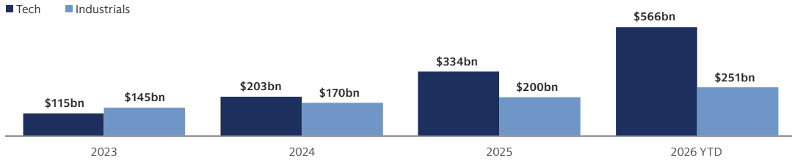

## Digital Twins as the Foundation / 以数字孪生为基础

Underpinning this overlay is the digital twin, a virtual rendering of a physical asset, facility, or process built to high fidelity against its real-world counterpart. In 1970, NASA engineers used a ground-based simulator of Apollo 13 to isolate the electrical fault that had ruptured an oxygen tank. Today, industrial operators run persistent digital twins of entire factories, modeling the cost, throughput, and ROI implications of any change before it's made.

支撑这一覆盖层的是数字孪生，即以现实对应物为参照、高保真构建的物理资产、设施或流程的虚拟呈现。1970 年，NASA 工程师使用阿波罗 13 号的地面模拟器，定位了导致氧气罐破裂的电气故障。如今，工业运营商持续运行整座工厂的数字孪生，在实施任何变更之前模拟其成本、吞吐量和投资回报影响。

Formula One offers a clear proof of concept. Racing teams run digital twins of their cars, simulating thousands of laps before race day in a risk-free environment, aiming to close the “correlation gap” between simulation and reality.

一级方程式赛车提供了清晰的概念验证。车队运行赛车的数字孪生，在比赛日前于无风险环境中模拟数千圈，力求缩小模拟与现实之间的“相关性差距”。

Siemens' $5.1 billion acquisition of Dotmatics in 2025 sharpens the industrial logic further.²¹ Siemens already owned much of the equipment that manufactures pharmaceutical products; with Dotmatics, it moved upstream into designing them, using AI to simulate drug chemistry, compress discovery timelines, and virtualize the trial process itself. The acquisition extends digital twin architecture from factory floor to laboratory bench, and from a single industry into the first end-to-end platform spanning research through manufacturing for life sciences.

西门子于 2025 年以 51 亿美元收购 Dotmatics，进一步强化了这一工业逻辑。²¹ 西门子原本已拥有大量用于制造医药产品的设备；借助 Dotmatics，它向上游延伸至产品设计，利用人工智能模拟药物化学、缩短发现周期，并将试验流程本身虚拟化。此次收购将数字孪生架构从工厂车间延伸到实验室工作台，并从单一行业扩展为首个覆盖生命科学研发到制造全流程的端到端平台。

Recent strategic activity illustrates this broader pattern. Synopsys, Inc.'s $35 billion acquisition of Ansys (completed July 2025), the largest pure-software industrial engineering deal of the last decade, consolidated simulation, chip design, and physics-based modeling into a single platform serving semiconductors, aerospace, and automotive.²² Emerson's roughly $17 billion acquisition of AspenTech, completed in March 2025 with the purchase of the remaining 43% stake, brought process simulation, asset performance management, and industrial AI software into Emerson's automation portfolio.²³

近期战略活动体现了这一更广泛的模式。新思科技以 350 亿美元收购 Ansys（于 2025 年 7 月完成），这是过去十年规模最大的纯软件工业工程交易，将仿真、芯片设计和基于物理的建模整合进一个服务于半导体、航空航天和汽车行业的平台。²² 艾默生以约 170 亿美元收购 AspenTech，并于 2025 年 3 月通过购买剩余 43% 股份完成交易，由此将流程仿真、资产绩效管理和工业人工智能软件纳入其自动化产品组合。²³

These platforms are becoming the control plane, and physical operations are reorganizing around them. The M&A consequence: Industrial AI software is now an acquisition target category on par with enterprise data infrastructure, and sector valuation multiples are pricing accordingly. Vertical integration is the unifying logic—each acquirer moving upstream or into an adjacent layer to own the full toolchain within its domain rather than buying scale across it—and it is emerging as an M&A category in its own right. The financing instruments that work for digital infrastructure extend to industrial AI software. The next layer of deployment (humanoids, industrial robots, autonomous fleets) is hardware. The financing architecture for that layer does not yet exist, but it will likely come next.

这些平台正在成为控制平面，实体运营则围绕它们重组。其并购影响是：工业人工智能软件如今已成为与企业数据基础设施同等重要的收购目标类别，行业估值倍数也据此定价。垂直整合是统一逻辑——每个收购方都向上游或相邻层移动，以拥有自身领域的完整工具链，而不是横向购买规模——并正发展为独立的并购类别。适用于数字基础设施的融资工具也可延伸到工业人工智能软件。下一层部署——人形机器人、工业机器人和自动驾驶车队——属于硬件。该层的融资架构尚不存在，但很可能是下一步。

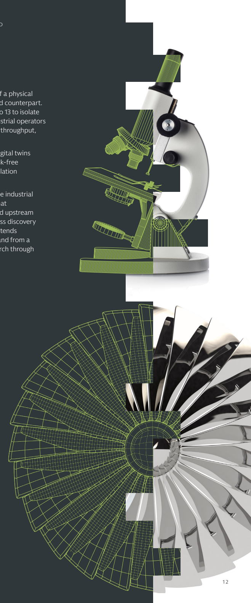

> “After a decade defined by systems that recognize patterns and predict text, the frontier of AI is shifting toward models that understand how the world works—a quiet but decisive change in how machines become intelligent.”
>
> “在由识别模式和预测文本的系统所定义的十年之后，人工智能前沿正转向理解世界如何运作的模型——这是机器获得智能方式中一场安静但决定性的变化。”
>
> **George Lee | Co-Head of the Goldman Sachs Global Institute**
>
> **乔治·李｜高盛全球研究院联席主管**

> “We are in the middle of an industrial revolution—fueled by the excitement of AI productivity gains and a significant need for investment and CapEx—which presents tremendous opportunities.”
>
> “我们正处于一场工业革命之中——人工智能带来的生产率提升令人振奋，同时也存在巨大的投资和资本支出需求——这带来了重大机遇。”
>
> **Anthony Gutman | Co-Chief Executive Officer of Goldman Sachs International and Global Co-Head of Investment Banking**
>
> **安东尼·古特曼｜高盛国际联席首席执行官、投资银行全球联席主管**

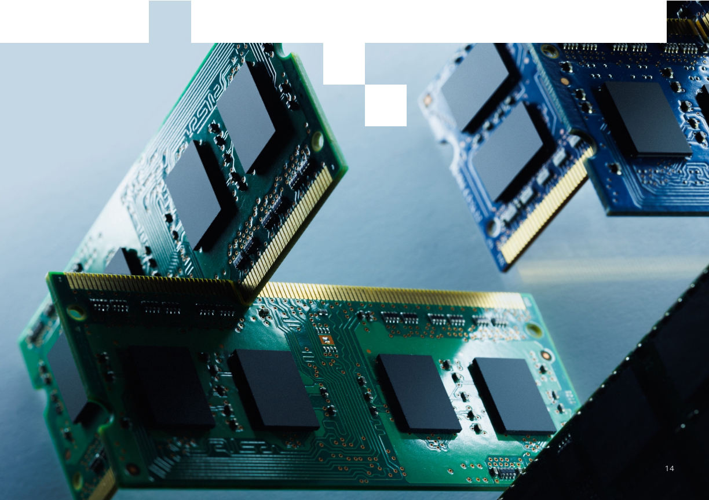

## Five Factors That Will Determine Industrial AI Winners / 决定工业人工智能赢家的五大因素

Industrial AI does not commoditize the way language AI does. Five factors will determine which companies build advantage in the  category. The companies that consolidate all five build a durable, competitive position. The companies that build only one or two   end up commoditized.

工业人工智能不会像语言人工智能那样商品化。五个因素将决定哪些公司能在这一类别中建立优势。将五项因素全部整合的公司能够形成持久的竞争地位；只具备一两项的公司最终会被商品化。

<table>
<tr><td><strong>Physics-based architecture / 基于物理的架构</strong> Unlike language-based AI, Industrial AI cannot scale past the laws of physics. Industrial AI systems must be designed against material properties, thermodynamics, and mechanical tolerances from the start. 与基于语言的人工智能不同，工业人工智能无法超越物理定律扩展。工业人工智能系统从一开始就必须依据材料属性、热力学和机械公差进行设计。</td><td><strong>Proprietary data / 专有数据</strong> The best training data for physical systems lives inside manufacturers, utilities, and simulation libraries, not on the public internet. 物理系统最优质的训练数据存在于制造商、公用事业公司和仿真库内部，而不在公共互联网上。</td><td><strong>Edge deployment capability / 边缘部署能力</strong> Most industrial AI must run inside the machine on the grid node, and on the embedded controller—not just in a cloud data center. 大多数工业人工智能必须运行在机器内部、电网节点和嵌入式控制器上，而不只是云数据中心内。</td></tr>
<tr><td><strong>Certifiability / 可认证性</strong> In aviation, energy infrastructure, and automotive, a single AI hallucination can have catastrophic consequences. Certification is the gating threshold for deployment. 在航空、能源基础设施和汽车领域，一次人工智能幻觉就可能造成灾难性后果。认证是部署的准入门槛。</td><td colspan="2"><strong>Workflow integration / 工作流整合</strong> The winner embeds AI as a capability layer into existing systems rather than imposing rip-and-replace on decades of operational practice. 赢家会把人工智能作为能力层嵌入现有系统，而不是强迫企业推倒重来、替换数十年积累的运营实践。</td></tr>
</table>

## III. Robotics and Physical Deployment / 三、机器人与实体部署

Physical AI refers to intelligent systems that operate in the physical world, including autonomous vehicles and industrial equipment, industrial robots, drones, and humanoid robots. Humanoid robotics dominate the conversation, but non-humanoid systems already operate at far greater scale—and some of the largest bets in the category are not robots at all. Prometheus, cofounded by Jeff Bezos and  Vik Bajaj, is building an “artificial general engineer”: software meant to design and engineer complex physical systems, from jet engines to drug compounds. It raised $12 billion in June 2026 at a roughly $41 billion valuation, among the largest early-stage investments in the category to date.25 In addition to venture capital, institutional investors played a significant role, signaling that institutional capital is moving  in ahead of commercial deployment economics. AI compresses the invention and engineering cycle itself, scaling industrial transformation  and productivity well beyond current AI uses—reshaping processes, industrial design, and automation.

实体人工智能是指在物理世界中运行的智能系统，包括自动驾驶车辆和工业设备、工业机器人、无人机及人形机器人。人形机器人主导了讨论，但非人形系统早已以大得多的规模运行——而且该类别中一些最大的押注甚至根本不是机器人。由杰夫·贝索斯和维克·巴贾杰共同创立的 Prometheus 正在打造“通用人工工程师”：用于设计和工程化复杂物理系统的软件，范围从喷气发动机到药物化合物。该公司于 2026 年 6 月融资 120 亿美元，估值约 410 亿美元，是该类别迄今规模最大的早期投资之一。²⁵ 除风险投资外，机构投资者也发挥了重要作用，表明机构资本正在商业部署经济性成熟之前提前进入。人工智能压缩发明与工程周期本身，使工业转型和生产率提升的规模远超当前用途——重塑流程、工业设计与自动化。

### Humanoids: The Contested Category / 人形机器人：竞争激烈的类别

The case for humanoids is centered on the need for labor. The United States has 13 million manufacturing workers, more job openings than available workers, and more than one million unfilled materials-handling roles. Goldman Sachs Global Investment Research projects  the humanoid market growing from 20,000 units in 2025 to 1.4 million units by 2035.26 Autonomous industrial equipment such as Deere’s  field systems and Caterpillar’s mining platforms extends the same labor-substitution dynamic into agriculture and heavy industry, where  the unit economics are more settled. Deere puts autonomy at the center of its lineup, with machines like the X9 combine as an answer to   a worsening labor shortfall, while Caterpillar uses the same approach with its autonomous mining fleet safely hauling over 11 billion tons   of material.27

人形机器人的商业逻辑以劳动力需求为中心。美国拥有 1,300 万制造业工人，职位空缺多于可用工人，并有超过 100 万个物料搬运岗位无人填补。高盛全球投资研究预计，人形机器人市场将从 2025 年的 2 万台增长至 2035 年的 140 万台。²⁶ 约翰迪尔的农田系统和卡特彼勒的采矿平台等自主工业设备，将同样的劳动力替代逻辑延伸到单位经济性更成熟的农业和重工业。约翰迪尔将自主能力置于产品线核心，用 X9 联合收割机等设备应对日益严重的劳动力短缺；卡特彼勒则以同样方式部署自主采矿车队，已安全运输超过 110 亿吨物料。²⁷

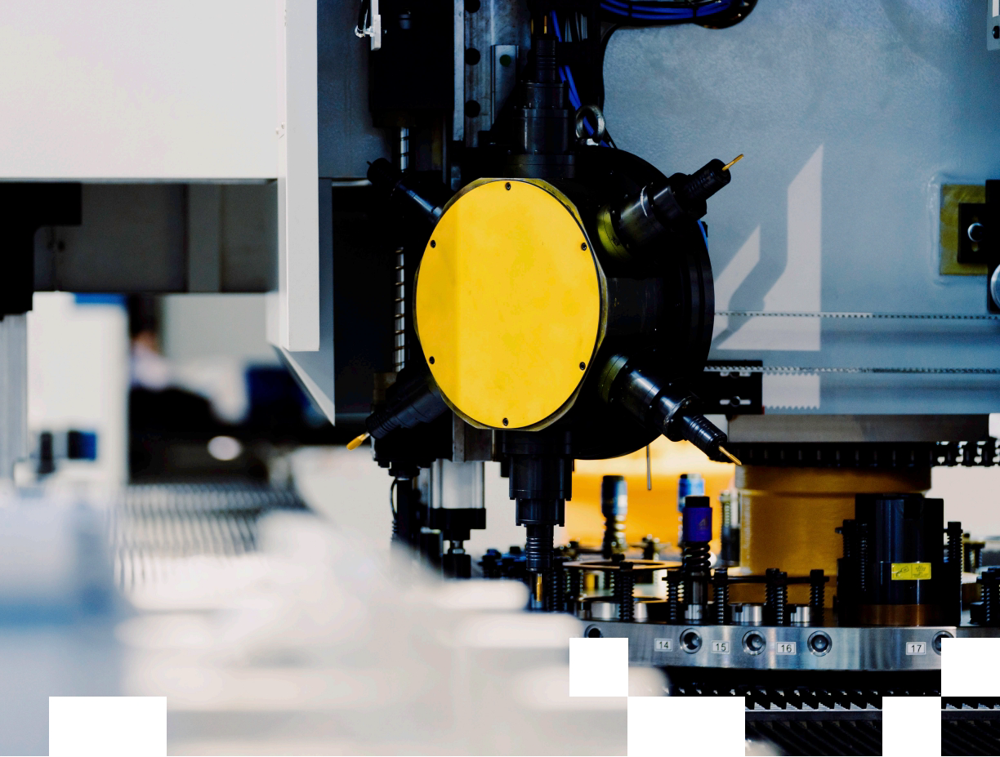

> “AI optimizes brilliantly within its simulation assumptions, but real materials, tolerances, and the chaos of a live operating environment are never exactly as modeled. A theoretically perfect design can fail because of it.”
>
> “人工智能能在其仿真假设范围内出色地优化，但真实材料、公差以及现场运营环境的混乱从来不会与模型完全一致。理论上完美的设计可能因此失败。”
>
> **Jack Anstey | Managing Director in Technology, Media, and Telecom Investment Banking**
>
> **杰克·安斯蒂｜科技、媒体与电信投资银行董事总经理**

### The commercial model for humanoid robotics is progressing unevenly across three variables that determine viability. / 人形机器人的商业模式在决定可行性的三个变量上进展不一。

Capital is the leading indicator—venture funding for companies like Figure, Apptronik, 1X, and Agility has flowed into the space well ahead of revenue, appropriate to the category's stage but underwriting a longer horizon than traditional growth equity models. Hardware is advancing quickly, with multiple platforms demonstrating credible task performance in controlled commercial environments. Workflow integration lags both: embedding humanoids into existing operations, training the workforce, and reaching the unit economics that institutional capital requires all present real challenges. Humanoids need patient, capital-heavy funding suited to long build-and-deploy horizons—closer to deep-tech infrastructure than the faster, capital-light model of venture growth.

资本是领先指标——对 Figure、Apptronik、1X 和 Agility 等公司的风险投资早在收入出现前就已流入这一领域，这符合该类别所处阶段，但承保周期长于传统成长型股权模式。硬件进步迅速，多个平台已在受控商业环境中展示可信的任务表现。工作流整合则落后于前两者：将人形机器人嵌入现有运营、培训员工并达到机构资本要求的单位经济性，都构成现实挑战。人形机器人需要耐心且资本密集的融资，以适应漫长的建设与部署周期——更接近深科技基础设施，而不是速度更快、资本更轻的风险成长模式。

Institutional investors face a significant gap between what these companies aim to build and what can actually be underwritten. Raising the capital that AI-native companies need for compute, hardware, and manufacturing is difficult with few customers and no proven financials. Late-stage private equity is absorbing venture-stage technology risk, with no scaled equivalent of credit wrapping for hardware-intensive deployment and no structure to make digital infrastructure financeable at scale for the physical category.

这些公司的建设目标与实际可承保内容之间存在显著差距，机构投资者必须面对这一问题。当客户寥寥且财务表现尚未验证时，人工智能原生公司很难筹集算力、硬件和制造所需资本。后期私募股权正在吸收风险投资阶段的技术风险；对于硬件密集型部署，尚无规模化的信用增级等价机制，也没有能让实体类别的数字基础设施实现大规模融资的结构。

## Non-Humanoid Robotics Working Today / 当下已经投入运行的非人形机器人

Today, humanoids are not where industrial robotics generates revenue. Millions of industrial robots, warehouse fleets, and autonomous vehicles are in active use. Next-generation fulfillment centers are now designed around 10-times-higher robotics density from the outset.²⁸ Symbotic operates dark warehouses for Walmart, as a leading public-market beneficiary of warehouse automation capital flows. In June 2026, Amazon unveiled its latest Proteus autonomous mobile warehouse robot, which responds to natural language. Purpose-built hardware, Al-driven logistics orchestration, and integration into existing retail operations have all attracted investors who understand the unit economics and are putting capital to work.

如今，工业机器人收入并非来自人形机器人。数百万台工业机器人、仓储车队和自动驾驶车辆正在使用。下一代履约中心从设计之初就以高出 10 倍的机器人密度为基础。²⁸ Symbotic 为沃尔玛运营无人化仓库，是仓储自动化资本流动在公开市场上的主要受益者。2026 年 6 月，亚马逊发布了最新的 Proteus 自主移动仓储机器人，可响应自然语言。专用硬件、人工智能驱动的物流编排以及与现有零售运营的整合，都吸引了理解单位经济性并投入资本的投资者。

A cohort of China's industrial AI developers (Unitree, UBTECH, Galbot, AgiBot, Spirit AI, XPENG, LimX) is advancing humanoid/ embodied-AI platforms at lower cost. A Goldman Sachs research report on 14 Chinese robotics companies saw single-purpose systems moving toward integrated AI stacks pairing vision-language-action models with world models.²⁹ The capital behind “data factories” addressing the training-data bottleneck is also scaling: Galbot raised 2.5 billion yuan ($350 million) in early 2026,³⁰ and Unitree cleared a STAR Market IPO review in June 2026. While cost falls on scale and full-stack control, broad commercial deployment isn't expected until 2027–2029.

一批中国工业人工智能开发商（宇树科技、优必选、银河通用、智元机器人、灵心巧手、小鹏、逐际动力）正在以更低成本推进人形机器人和具身人工智能平台。高盛一份研究 14 家中国机器人公司的报告发现，单一用途系统正转向把视觉—语言—动作模型与世界模型相结合的集成人工智能栈。²⁹ 为解决训练数据瓶颈而建设的“数据工厂”背后资本也在扩大：银河通用于 2026 年初融资 25 亿元人民币（3.5 亿美元），³⁰ 宇树科技于 2026 年 6 月通过科创板 IPO 审核。尽管规模化和全栈控制会降低成本，但预计广泛商业部署要到 2027 至 2029 年才会出现。

Funding is coalescing first around applications whose unit economics are closest to existing underwriting frameworks: logistics automation, predictive maintenance, and warehouse robotics. They are forming unevenly or not at all around applications where venture-stage risk persists. The gap is material, and bridging it has become one of the largest financing questions of the decade.

资金首先汇集到单位经济性最接近现有承保框架的应用：物流自动化、预测性维护和仓储机器人。对于仍有风险投资阶段风险的应用，融资结构形成不均，甚至根本尚未形成。这一差距十分重大，如何弥合它已成为本十年最大的融资问题之一。

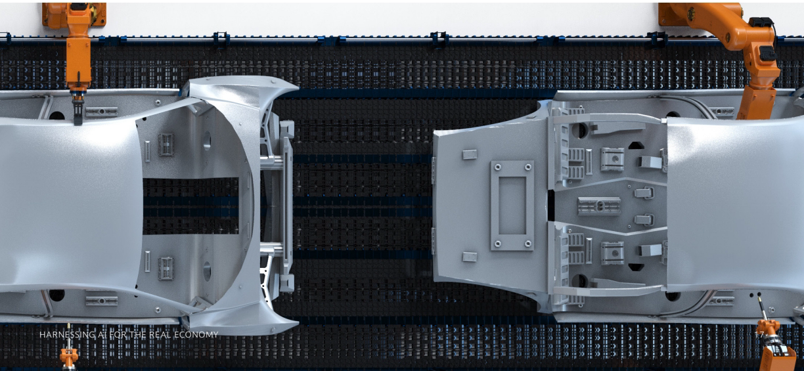

## IV. Defense as a Strategic Extension / 四、国防作为战略延伸

Physical AI deployment, sovereign-government capital partnership, and supply chains repositioned around strategic competition all concentrate in defense. The sector is the most acute test case for the AI economy's industrial logic. Procurement cycles can run a decade or more, capital formation is dominated by a small number of large “primes,” and technology adoption moves relatively slowly. AI is changing all three at once, and the shift is visible in companies now challenging the incumbents.

实体人工智能部署、主权政府资本合作，以及围绕战略竞争重新布局的供应链，都集中体现在国防领域。该行业是检验人工智能经济工业逻辑最尖锐的案例。采购周期可能长达十年甚至更久；资本形成由少数大型“主承包商”主导；技术采用相对缓慢。人工智能正在同时改变这三者，而这种变化已在挑战传统巨头的公司身上显现。

AI in defense is not a replacement for engagement. It is a force multiplier across every stage before the trigger decision, and across the surveillance, communications, and logistics systems that sit around it. Autonomous flight and unmanned aircraft systems are early-mover categories because the human-in-the-loop question is manageable. The operator controls the mission; AI handles flight, navigation, and target identification. The global military drone market reached approximately $20 billion in 2026 and is projected to roughly double over the next decade.³¹

国防领域的人工智能并非要替代交战决策。它是扣动扳机决策前每个阶段，以及周边监视、通信和后勤系统中的力量倍增器。自主飞行和无人航空系统是率先发展的类别，因为人类在环问题可控。操作员控制任务；人工智能负责飞行、导航和目标识别。2026 年全球军用无人机市场规模达到约 200 亿美元，预计未来十年将大致翻倍。³¹

### To Infinity … / 向无限延伸……

The operating logic now reshaping defense extends into orbit. Both domains run on the same requirement: AI is not an enhancement but a precondition for operating in today's environment. Both categories face the same constraints—contested signal environments, denied or degraded GPS, latency-sensitive autonomy, and compute that has to function at the edge. The architecture that makes a drone swarm coherent is the architecture that makes satellites operationally useful, and the capital flowing into both has begun to converge.

如今重塑国防的运营逻辑正延伸至轨道。两个领域都建立在同一要求之上：人工智能不是增强功能，而是在当今环境中运行的先决条件。两类业务面临同样的约束——受争夺的信号环境、被拒止或降级的 GPS、对时延敏感的自主能力，以及必须在边缘运行的计算。使无人机群协同一致的架构，也正是让卫星具备运营价值的架构；流向两者的资本已开始汇流。

SpaceX, whose June public market debut saw a record-setting valuation, is a clear example. Following the February 2026 xAI acquisition, it operates as a defense, connectivity, and AI compute business within a single structure. The company is now building an orbital compute layer on top of that network—sun-synchronous-orbit satellites running AI inference at scale, with deployment targeted from 2028. A capital-markets pipeline is forming around space-tech operators whose end customers are defense agencies, and the distinction between a defense listing and a space listing is becoming increasingly narrow.

SpaceX 是一个清晰例子，其 6 月公开市场首秀创下估值纪录。在 2026 年 2 月收购 xAI 后，它在单一结构内同时运营国防、连接和人工智能算力业务。该公司如今正在该网络之上构建轨道计算层——让太阳同步轨道卫星大规模运行人工智能推理，计划从 2028 年开始部署。围绕终端客户为国防机构的太空科技运营商，资本市场项目管线正在形成；国防上市与太空上市之间的界限日益模糊。

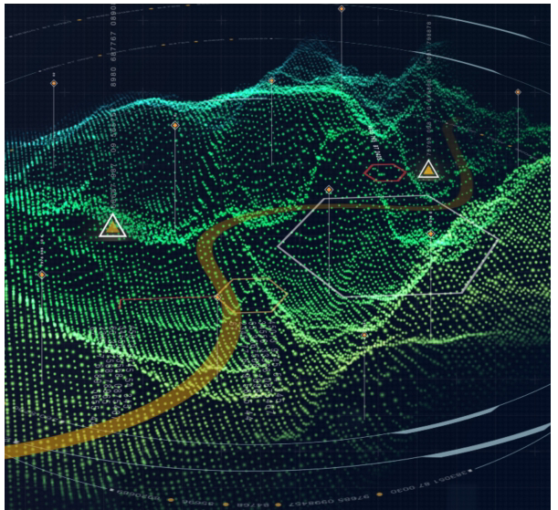

> “As uncomfortable as the idea may be, fully autonomous, AI-executed warfare is an inevitability. It’s just a matter of who leads the way.”
>
> “尽管这个想法可能令人不安，但完全自主、由人工智能执行的战争不可避免。问题只是谁将引领这一进程。”
>
> **Erik Sparks | Head of Global Resilience Investment Banking**
>
> **埃里克·斯帕克斯｜全球韧性投资银行主管**

The more consequential change lies in who finances defense technology. Five years ago, defense was a sector many venture capital firms actively avoided. Working with government was considered an exit barrier, a reputational cost, or both. That position has begun to materially shift.

更具深远影响的变化在于由谁为国防科技融资。五年前，国防还是许多风险投资公司主动回避的行业。与政府合作被视为退出障碍、声誉成本，或两者兼有。如今，这种立场已开始实质性转变。

Legacy technology players are now willing to partner on defense. In July 2025, the Department of Defense awarded Google Public Sector and OpenAI contracts valued up to $200 million for military AI, with parallel awards to Anthropic and xAI.³² The capital markets pipeline is also growing, with defense-focused IPOs in 2025-2026 for Firefly, AEVEX, Hawkeye, York Space Systems, and SpaceX.

传统科技公司如今愿意在国防领域开展合作。2025 年 7 月，美国国防部向 Google Public Sector 和 OpenAI 授予价值最高 2 亿美元的军用人工智能合同，并向 Anthropic 和 xAI 发放了平行合同。³² 资本市场项目管线也在增长，Firefly、AEVEX、Hawkeye、York Space Systems 和 SpaceX 于 2025 至 2026 年间进行了以国防为重点的 IPO。

M&A in defense, by contrast, remains structurally constrained by a valuation mismatch across the industry and a reticence by challengers to be absorbed into the procurement cultures they were built to disrupt. For now, capital is forming through direct investment and public-market issuance rather than strategic consolidation. A new financing pattern is also emerging—cross-border investment backed by US-government structural support.

相比之下，国防并购仍受到结构性限制：全行业存在估值错配，而挑战者也不愿被吸收到它们原本要颠覆的采购文化中。目前，资本主要通过直接投资和公开市场发行形成，而不是战略整合。一种新的融资模式也正在出现——由美国政府结构性支持的跨境投资。

## The Challenger Generation / 挑战者一代

**AMERICAS / 美洲**

Anduril, founded in 2017 with seed capital from Founders Fund, progressed through six venture rounds in eight years, closing a $5 billion Series H in May 2026 at a $61 billion valuation, with a product line spanning air, ground, maritime, and counter-UAS systems unified through the company's software backbone.³³ Its partnership with OpenAI brings frontier AI into national security systems. For institutional investors, the progression signals that defense tech terminal values have moved from speculative to underwritable in under a decade.

Anduril 于 2017 年以 Founders Fund 的种子资本创立，八年内完成六轮风险融资，并于 2026 年 5 月以 610 亿美元估值完成 50 亿美元 H 轮融资。其产品线横跨空中、地面、海上和反无人机系统，并通过公司的软件骨干统一起来。³³ 它与 OpenAI 的合作将前沿人工智能引入国家安全系统。对机构投资者而言，这一历程表明，国防科技的终值在不到十年内已从投机对象转变为可承保资产。

**eMEA / 欧洲、中东和非洲**

A European analog, Helsing, was founded in 2021 and reached a €12 billion valuation in a €600 million Series D in June 2025, deploying AI-powered software and an AI-native strike drone across the German and UK militaries.³⁴ Much of Europe's strength sits in dual-use engineering rather than pure-play defense. Industrial AI firm PhysicsX raised a $300 million Series C in June 2026 at a roughly $2.4 billion valuation.³⁵ Its AI-native physics simulation compresses aerospace/defense, semiconductor, automotive, and energy engineering from days to seconds—supplying the defense sector without being defined by it.

欧洲的对应企业 Helsing 创立于 2021 年，并在 2025 年 6 月的 6 亿欧元 D 轮融资中达到 120 亿欧元估值，其人工智能软件和人工智能原生攻击无人机已部署于德国和英国军队。³⁴ 欧洲的优势很大一部分位于军民两用工程，而非纯国防业务。工业人工智能公司 PhysicsX 于 2026 年 6 月以约 24 亿美元估值完成 3 亿美元 C 轮融资。³⁵ 其人工智能原生物理仿真将航空航天与国防、半导体、汽车和能源工程所需时间从数天压缩至数秒——服务国防行业，却不由国防行业定义。

**APAC / 亚太**

China presents a structurally different third frame. Domestic defense tech operates inside a military-civil fusion framework that blends state R&D, sovereign capital, and industrial manufacturing in ways US and European systems do not. The procurement pipeline does not face the VC-vs.-government cultural friction that Anduril and Helsing initially navigated, which could create a significant competitive advantage.

中国呈现出结构上不同的第三种框架。国内国防科技在军民融合框架内运作，以美欧体系所不具备的方式结合国家研发、主权资本与工业制造。其采购管线不面临 Anduril 和 Helsing 最初经历的风险投资与政府之间的文化摩擦，这可能形成显著竞争优势。

## V. Energy Remains the Binding Constraint / 五、能源仍是硬约束

### The capital structures enabling defense, industrial AI, and data center buildout all eventually hit the same gating constraint: power. / 支撑国防、工业人工智能和数据中心建设的资本结构，最终都会遇到同一个准入约束：电力。

AI training and inference are not the only sources of new load. As autonomous systems proliferate—electric and autonomous vehicles, industrial robots, and sensor-instrumented dark plants—each becomes a continuous generator of data that must be ingested, modeled, and acted on. That processing demand compounds the training and inference load already driving the buildout, and it sits largely outside projections calibrated to today's language-model usage. Physical deployment is not only a consumer of AI; it is a fast-growing source of the compute—and the power—the next phase will require.

人工智能训练和推理并非新增负荷的唯一来源。随着自主系统普及——电动和自动驾驶车辆、工业机器人以及配备传感器的无人化工厂——每个系统都会持续生成必须摄取、建模并采取行动的数据。这种处理需求叠加于已在推动建设的训练和推理负荷之上，而基于当今语言模型使用情况校准的预测基本未将其纳入。实体部署不仅是人工智能的消费者，也正迅速成为下一阶段所需算力与电力的来源。

Today's grid was built for a different demand profile. Utilities sized capacity around predictable residential and commercial load at roughly 60% average utilization; AI training is unpredictable and clustered in remote markets. A mature AI buildout pushes utilization toward 90%, where most utility operating assumptions cease to hold. The geographic mismatch compounds the problem—Abilene, Texas is now a market whose power demand equals that of San Francisco. Grid interconnection queues in the most important data center markets stretch eight to 12 years, two to three generations of GPU hardware.³⁶

如今的电网是为不同的需求曲线建设的。公用事业公司围绕可预测的住宅和商业负荷配置容量，平均利用率约 60%；人工智能训练则不可预测，并集中在偏远市场。成熟的人工智能建设会将利用率推向 90%，届时大多数公用事业运营假设将不再成立。地域错配使问题进一步加剧——得克萨斯州阿比林如今已成为电力需求等同于旧金山的市场。在最重要的数据中心市场，电网并网队列长达 8 至 12 年，相当于两至三代 GPU 硬件周期。³⁶

### US data center power demand capacity / 美国数据中心电力需求容量

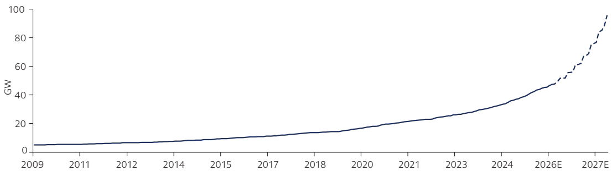

Source: Alterio, Goldman Sachs Global Investment Research. / 来源：Alterio、高盛全球投资研究。

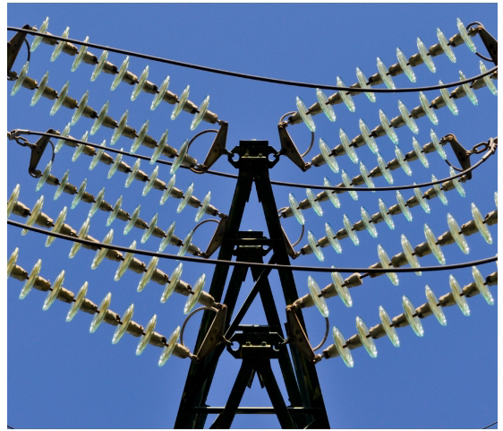

Behind-the-meter power has come into focus as one of a handful of emergent responses. A year ago, fully islanded data centers were rare and not considered a mainstream solution for hyperscale AI infrastructure. Over the last 12 to 18 months, they have moved from an edge case to a credible development pathway driven by grid interconnection delays and the economics of AI compute. Estimates now suggest one-third of future capacity could be islanded, either permanently or as a bridge to eventual grid interconnection. Microsoft, Meta, and Oracle are deploying fully islanded gas generation.

表后供电已成为少数几种新兴应对方案之一。一年前，完全孤岛运行的数据中心仍很少见，也不被视为超大规模人工智能基础设施的主流解决方案。在过去 12 至 18 个月里，受电网并网延迟和人工智能算力经济性的推动，它们已从边缘案例转变为可信的发展路径。目前估计，未来三分之一的容量可能采用孤岛运行，或永久如此，或作为最终并网前的过渡。微软、Meta 和甲骨文正在部署完全孤岛运行的燃气发电。

The public markets are now pricing the equipment layer behind this shift: in June 2026, Goldman Sachs acted as joint lead bookrunner on the NASDAQ IPO for INNIO—the gas-engine maker whose Jenbacher systems power is landed data centers—an upsized offering that raised roughly $2.4 billion.³⁷ Project finance structures originally built for grid-connected power generation are being adapted at scale for behind-the-meter generation dedicated to data center load—a natural evolution in how capital underwrites power infrastructure.

公开市场如今正为这一转变背后的设备层定价：2026 年 6 月，高盛担任 INNIO 纳斯达克 IPO 的联席牵头簿记管理人；这家燃气发动机制造商的 Jenbacher 系统为孤岛数据中心供电，此次扩大发行规模后融资约 24 亿美元。³⁷ 原本为并网发电设计的项目融资结构，正被大规模改造，用于专门服务数据中心负荷的表后发电——这是资本承保电力基础设施方式的自然演进。

Nuclear is also back on the table: Microsoft's Three Mile Island restart agreement (September 2024) and Amazon's small modular reactor investments (October 2024) reflect hyperscalers' evolution from power customers to active participants in power development, and their willingness to bring capital and demand to address power constraints. The uranium conversion bottleneck is a separate concern, with only three Western conversion facilities operating against the rest of global capacity concentrated in Russia and China. Generation is only part of the build. Enabling AI at this scale has also drawn significant into the systems around it—electric utility modernization to carry and balance the new load, and water infrastructure to cool it—each a capital-intensive build in its own right. Water is the less-visible side of that build: roughly two-thirds of US data centers built or planned since 2022 sit in water-stressed regions, and data-center water demand is on track to roughly double by 2030—making cooling supply a siting and financing variable, not just an operating cost.³⁸ These constraints determine whether the AI economy's power layer gets built at the pace the compute layer demands—and whether the new structures bridging utility, hyperscaler, and private capital become the template for capital formation across other physical AI domains.

核能也重新进入议程：微软的三里岛重启协议（2024 年 9 月）和亚马逊对小型模块化反应堆的投资（2024 年 10 月），体现了超大规模云服务商正从电力客户转变为电力开发的积极参与者，并愿意投入资本和需求以解决电力约束。铀转化瓶颈是另一项隐忧：西方仅有三座转化设施在运行，其余全球产能则集中于俄罗斯和中国。发电只是建设的一部分。为实现如此规模的人工智能，周边系统也吸引了大量投入——电力公用事业现代化以输送和平衡新增负荷，以及用于冷却的数据中心水务基础设施——每一项本身都是资本密集型建设。水是这轮建设中较不显眼的一面：自 2022 年以来美国已建或规划的数据中心约三分之二位于水资源紧张地区，而数据中心用水需求预计到 2030 年大致翻倍——这使冷却水供应不仅是运营成本，也成为选址和融资变量。³⁸ 这些约束决定人工智能经济的电力层能否以算力层要求的速度建成，也决定连接公用事业、超大规模云服务商和私人资本的新结构，能否成为其他实体人工智能领域资本形成的模板。

Power is a critical bottleneck—but increasingly, the requisite labor presents a structural constraint of its own. The technical workforce that constructs, wires, cools, and secures this infrastructure is in acute demand, and training cannot happen at the pace capital is being committed. Goldman Sachs Global Investment Research estimates the US power and grid value chain will need more than 500,000 additional workers by 2030, roles that will take three to four years of training to fill. The shortfall is best read as a rate problem: the energy-apprenticeship pipeline ran at 45,000 entrants in 2024 and would need to sustain 65,000 per year now to close it,³⁹ even before including retirements that outpace new entrants. The implication for capital is direct—financing structures that treat skilled labor as available rather than as a multiyear constraint will encounter delays that capital alone cannot resolve.

电力是关键瓶颈——但所需劳动力也日益形成自身的结构性约束。建设、布线、冷却和保护这些基础设施的技术劳动力需求极其旺盛，而培训速度无法追上资本投入速度。高盛全球投资研究估计，到 2030 年，美国电力和电网价值链将需要新增 50 多万名工人，而这些岗位需要三至四年培训才能胜任。最好把这一缺口理解为速度问题：2024 年能源学徒管线有 4.5 万人进入，如今需要维持每年 6.5 万人的规模才能弥合缺口，³⁹ 这甚至还未计入退休人数超过新增人数的影响。对资本的启示十分直接——如果融资结构将熟练劳动力视为随时可得，而不是多年期约束，就会遭遇仅靠资本无法解决的延误。

These constraints also point beyond the grid. As compute and data-processing demand compounds, the requirement is not only for power but also for moving data at scale with minimal latency—pressure that is already accelerating change within the AI ecosystem, from the physical transmission layer to where computation happens. The same logic that put AI inference into orbit for defense and connectivity extends to energy: processing migrating closer to sustainable, abundant power, including in space. What reads today as a defense and space story is, underneath, the same compute-and-energy constraint expressed in a different domain—and a sign of how far the buildout's architecture may travel from today's earthbound data centers.

这些约束也指向电网之外。随着计算和数据处理需求叠加，需求不仅是电力，还包括以极低时延大规模传输数据——这种压力已在加速人工智能生态系统从物理传输层到计算发生地点的变化。将人工智能推理送入轨道以服务国防和连接的同一逻辑，也延伸到能源：处理正迁移至更接近可持续、充裕电力的地方，包括太空。今天看似国防与太空的故事，底层其实是同一算力与能源约束在不同领域的表达——也预示着建设架构可能远离如今地面数据中心的程度。

The power and energy sector has a long history of responding to strong economic signals with innovation, investment, and new business models.

电力与能源行业长期以来一直以创新、投资和新商业模式回应强烈的经济信号。

Today's power constraints are real, but so is the industry's ability to adapt. We are seeing innovation emerge across generation technologies, energy storage, financing structures, regulatory frameworks, power market design, and customer contracting models. Just as the shale revolution unlocked vast new energy supply through technological and commercial innovation, the growing demand for power from AI, data centers, and electrification is catalyzing a new wave of solutions. The bottlenecks are significant, but history suggests they are more likely to drive innovation than constrain growth indefinitely.

当今的电力约束确实存在，但行业适应能力也同样真实。我们看到创新正在发电技术、储能、融资结构、监管框架、电力市场设计和客户合同模式等领域涌现。正如页岩革命通过技术和商业创新释放了巨量新能源供应，人工智能、数据中心和电气化不断增长的电力需求也在催生新一轮解决方案。瓶颈十分重大，但历史表明，它们更可能推动创新，而不是无限期限制增长。

## VI. The Real Economy's Financing Divide / 六、实体经济的融资鸿沟

Across these various sectors, one divide recurs: the financing architecture is mature for some buildout layers and barely formed for others. Physical AI deployment is a visible issue. Humanoids, industrial robotics, and autonomous industrial systems carry venture-stage adoption risk in volumes only long-duration capital pools can currently fund at scale.

在这些不同领域中，同一条鸿沟反复出现：某些建设层的融资架构已经成熟，另一些则几乎尚未形成。实体人工智能部署是一个显著问题。人形机器人、工业机器人和自主工业系统承载着风险投资阶段的采用风险，其资金规模目前只有长期资本池才能大规模支持。

For allocator positioning, the implications remain concrete. Digital infrastructure is investable today through familiar instruments—investment-grade bonds, private credit, infrastructure debt funds, real estate trusts. Industrial AI software is accessible through public exposures and selective M&A. Physical AI relies primarily on venture and growth equity, carrying concentration and mismatch risk that institutions must weigh against the upside of underwriting a structurally important category early.

对于资产配置者的布局而言，影响十分具体。如今可以通过熟悉的工具投资数字基础设施——投资级债券、私募信贷、基础设施债务基金和房地产信托。工业人工智能软件可通过公开市场敞口和选择性并购参与。实体人工智能主要依赖风险投资和成长型股权，带来集中度与期限错配风险；机构必须将这些风险与及早承保这一结构性重要类别的上行潜力相权衡。

What sits on the other side of this gap is the real economy itself—the manufacturing, energy, robotics, defense, and logistics that AI will significantly change. Overall, the technology is arriving faster than the capital built to fund it. Which sectors thrive and which stall turns less on the tech frontier than on who closes the financing gap—a challenge of capital architecture as much as engineering.

鸿沟另一侧正是实体经济本身——人工智能将显著改变的制造、能源、机器人、国防和物流。总体而言，技术到来的速度快于为其融资的资本建设速度。哪些行业繁荣、哪些停滞，与其说取决于技术前沿，不如说取决于谁能弥合融资缺口——这既是工程挑战，也是资本架构挑战。

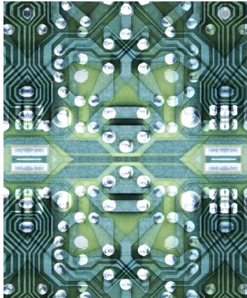

# SECTION 03 · Capital Architecture: Financing the Next Phase of Expansion / 第 03 节 · 资本架构：为下一阶段扩张融资

Strategic partnerships, sovereign capital, and new structured credit instruments are emerging in parallel—drawing on pools of capital that previous tech transitions didn't need to access. Institutions that can structure and direct that capital will shape the next phase of growth.

战略合作、主权资本和新型结构化信贷工具正在并行涌现——它们调用了以往技术转型无需触及的资本池。能够设计并引导这些资本的机构，将塑造下一阶段增长。

## Since 1869, Goldman Sachs has advised the companies behind every major capital transition. / 自 1869 年以来，高盛一直为每一次重大资本转型背后的企业提供顾问服务。

Building upon a legacy of capital markets innovation, we are positioned at the intersection of technological and industrial transformation alongside the institutional investors ready to seize this opportunity. Every layer of the transformation—software restructuring, industrial AI, robotics, defense, energy—draws from different capital pools and demands different structuring expertise.

凭借资本市场创新传统，我们与准备把握这一机遇的机构投资者一道，处于技术与工业转型的交汇点。转型的每一层——软件重组、工业人工智能、机器人、国防、能源——都从不同资本池获取资金，并需要不同的结构设计专长。

### The Complexity Premium / 复杂性溢价

Previous technology transitions rewarded deep expertise in a single domain. The railroad era turned on infrastructure bond structuring; the internet era on growth equity and technology M&A. In each, the financing challenge was coherent enough for specialist expertise to address. The AI economy is different in kind: data center construction financed through investment-grade markets, grid-connected power structures adapted for new generation needs, software-sector M&A, sovereign partnership structuring, and critical-materials supply-chain investment all run at once—each drawing on a distinct capital pool, structuring discipline, and regulatory framework. Prior eras had narrow, coherent financing challenges; the AI economy has many, simultaneously.

以往技术转型奖励单一领域的深厚专长。铁路时代取决于基础设施债券结构设计；互联网时代取决于成长型股权和科技并购。在每个时代，融资挑战都足够连贯，可由专业领域知识解决。人工智能经济则有本质不同：通过投资级市场融资的数据中心建设、为新发电需求改造的并网电力结构、软件行业并购、主权合作结构设计以及关键材料供应链投资同时推进——每一项都调用不同的资本池、结构设计方法和监管框架。以往时代的融资挑战狭窄而连贯；人工智能经济则同时面对多项挑战。

Cross-sector visibility is critical. We are advising hyperscalers on data center financing, utilities on grid upgrade financing, industrial companies on physical AI deployment, sovereign wealth funds on AI infrastructure co-investment, and software companies on the M&A defining the enterprise stack. In June 2026, Goldman Sachs acted as lead left bookrunner and placement agent on Alphabet's $90 billion equity raise—the largest equity offering on record—as even the most established technology leaders turned to the public markets to accelerate their AI ambitions.⁴⁰

跨行业视野至关重要。我们为超大规模云服务商的数据中心融资、公用事业公司的电网升级融资、工业企业的实体人工智能部署、主权财富基金的人工智能基础设施共同投资，以及软件公司塑造企业技术栈的并购提供顾问服务。2026 年 6 月，高盛担任 Alphabet 900 亿美元股权融资的牵头左侧簿记管理人和配售代理——这是有史以来规模最大的股权发行；即便最成熟的科技领导者，也转向公开市场以加速实现其人工智能雄心。⁴⁰

### Primary financing in instrument categories by technology / 各技术时代按工具类别划分的主要融资

<table>
<tr><th>Railroads 1830–1900 铁路 1830–1900</th><th>Internet 1995–2005 互联网 1995–2005</th><th>Al Economy 2025–2035 人工智能经济 2025–2035</th></tr>
<tr><td><strong>1 PRIMARY INSTRUMENT</strong> 1 种主要工具</td><td><strong>2 PRIMARY INSTRUMENTS</strong> 2 种主要工具</td><td><strong>PRIMARY INSTRUMENTS, SIMULTANEOUSLY</strong> 多种主要工具同时使用</td></tr>
<tr><td>Long-tenor infrastructure bonds 长期基础设施债券</td><td>Venture and growth equity 风险投资与成长型股权</td><td>Hyperscaler investment-grade debt 超大规模云服务商投资级债务</td></tr>
<tr><td></td><td>Technology M&amp;A 科技并购</td><td>Private credit, insurance, long-duration capital 私募信贷、保险资本、长期资本</td></tr>
<tr><td></td><td></td><td>Project finance and securitization 项目融资与证券化</td></tr>
<tr><td></td><td></td><td>Government-backed equity 政府支持的股权</td></tr>
<tr><td></td><td></td><td>Strategic, capability-driven M&amp;A 战略性、能力驱动型并购</td></tr>
<tr><td></td><td></td><td>Public growth equity 公开市场成长型股权</td></tr>
</table>

## Index Concentration Redraws the Capital Stack / 指数集中度重塑资本栈

At the center of these shifting capital structures is index concentration. AI-related debt issuance from hyperscalers and AI infrastructure companies reached roughly $121 billion in 2025—approximately 6.6% of the $1.83 trillion US investment-grade market, which itself approached the Covid-era high of $1.9 trillion. That share is projected to rise up to 20% in 2026 as hyperscaler unsecured issuance and project-finance bonds combine, a structural reweighting of the IG index that will have implications well beyond the issuers driving it.⁴¹ Allocator-level position limits, sector caps, and single-name concentration thresholds across institutional fixed-income portfolios were not calibrated for a digital-infrastructure share approaching one-fifth of the index. The constraint binds on both sides: hyperscalers face issuer-concentration limits that cap how much USD investment-grade debt any single name can absorb, and allocators face index-level concentration thresholds that cap how much exposure any portfolio can hold. Both forces push the same direction—driving diversification into EUR, GBP, and CHF issuance and migration of incremental financing need into private markets.

这些变化中的资本结构以指数集中度为核心。2025 年，超大规模云服务商和人工智能基础设施公司的人工智能相关债务发行达到约 1,210 亿美元——约占美国 1.83 万亿美元投资级市场的 6.6%，而该市场本身已接近新冠疫情时期 1.9 万亿美元的高点。随着超大规模云服务商无担保发行与项目融资债券相结合，预计 2026 年这一份额最高将升至 20%；投资级指数由此发生结构性再加权，其影响将远超推动这一变化的发行人。⁴¹ 机构固定收益投资组合的配置者层面头寸限制、行业上限和单一名称集中度阈值，并非按数字基础设施占指数近五分之一的情景校准。约束同时作用于两端：超大规模云服务商面临发行人集中度限制，制约单一名称可吸收的美元投资级债务规模；配置者则面临指数层面的集中度阈值，限制任何投资组合可持有的敞口。两股力量指向同一方向——推动发行向欧元、英镑和瑞士法郎多元化，并使新增融资需求迁移至私募市场。

That migration is reshaping the public-private mix. Hyperscaler benchmark global debt issuance reached $107 billion YTD, exceeding 2025's full-year volume and dwarfing 2024's total of less than $20 billion.⁴² For these issuers, traditional leverage metrics are no longer the binding constraint; US dollar index concentration is. As that incremental need moves off the IG index, private infrastructure and real estate funds come into focus: infrastructure funds raised a record $221 billion last year, and their growth may accelerate, potentially reaching $3 trillion in assets by 2030.⁴³

这种迁移正在重塑公募与私募的组合。超大规模云服务商全球基准债务年初至今发行额达到 1,070 亿美元，超过 2025 年全年规模，也远高于 2024 年不足 200 亿美元的总额。⁴² 对这些发行人而言，传统杠杆指标已不再是硬约束；美元指数集中度才是。随着新增需求移出投资级指数，私募基础设施和房地产基金进入视野：基础设施基金去年创纪录地募集 2,210 亿美元，其增长可能加速，到 2030 年资产规模或达到 3 万亿美元。⁴³

The traffic runs both ways. Asset-level project debt—amortizing bonds whose repayment is matched to a facility's contracted cash flows, historically the preserve of private credit—is now migrating into the public investment-grade market as the buildout outgrows private balance sheets. Meta's $27 billion Beignet financing for its Hyperion data center, completed late 2025, was the first such structure at this scale, with several comparable deals following in 2026.⁴⁴ The result is a genuine blending of public and private technique—project-finance discipline executed at public-market scale. This format could scale into hundreds of billions as more issuers fund construction in this way.

流动是双向的。随着建设规模超出私人资产负债表承载能力，资产层面的项目债务——偿还进度与设施合同现金流相匹配的摊还型债券，历史上一直是私募信贷的专属领域——如今正迁移到公开投资级市场。Meta 于 2025 年末完成的 Hyperion 数据中心 270 亿美元 Beignet 融资，是这一规模上的首个此类结构；2026 年又有数笔类似交易跟进。⁴⁴ 其结果是公募与私募技术真正融合——以公开市场规模执行项目融资纪律。随着更多发行人以此方式为建设融资，这种形式可能扩大至数千亿美元。

The private credit market has grown from approximately $500 billion in assets under management a decade ago to over $2.1 trillion today⁴⁵—and as AI infrastructure financing scales, the market is positioned to grow further still. The investment-grade private credit market uses data center assets and GPU fleets as collateral in ways that corporate balance sheet lending does not. Private credit-focused insurance capital and infrastructure debt funds are able to underwrite long-dated hyperscaler contracts the same way that power purchase agreements in energy and utilities are underwritten—treating contracted cash flows from investment-grade tenants as the bankable anchor for project-level debt. Sale-leaseback structures let data center owners monetize built assets while retaining operational control, recycling capital into new development. Robot-as-a-Service models, the subscription-economics template that enabled SaaS at scale, are now extending that same approach into physical AI procurement, shifting robotics from capital-expenditure to operating-expenditure accounting.

私募信贷市场的管理资产规模已从十年前的约 5,000 亿美元增长至如今超过 2.1 万亿美元⁴⁵——随着人工智能基础设施融资扩大，该市场还将进一步增长。投资级私募信贷市场以数据中心资产和 GPU 集群作为抵押品，其方式不同于企业资产负债表贷款。专注私募信贷的保险资本和基础设施债务基金，能够像承保能源与公用事业购电协议一样承保超大规模云服务商的长期合同——将投资级租户的合同现金流视为项目层面债务可融资的锚点。售后回租结构使数据中心所有者在保留运营控制权的同时，将已建资产变现，并把资本循环投入新开发项目。“机器人即服务”模式则把促成 SaaS 规模化的订阅经济模板延伸至实体人工智能采购，使机器人支出从资本支出会计转向运营支出会计。

### GPU Financing Emerges / GPU 融资兴起

The most novel evolution in AI infrastructure capital is the private credit market's adaptation to GPU financing. Unlike data center real estate, GPUs are short-duration, rapidly depreciating assets with technology obsolescence risk that traditional collateral frameworks were not built to underwrite.

人工智能基础设施资本最新颖的演进，是私募信贷市场对 GPU 融资的适应。与数据中心房地产不同，GPU 是期限短、贬值快且存在技术淘汰风险的资产，传统抵押品框架并非为承保这类资产而设计。

Private credit has moved fastest. Investors in the private credit asset-backed finance markets are now structuring facilities against GPU fleets with shorter tenors, embedded refresh provisions, and hyperscaler oftake or cloud-revenue commitments serving as the credit anchor. This is the financing layer where the gap between AI capital demand and traditional capital frameworks is widest, and where Goldman Sachs has helped shape the market.

私募信贷行动最快。私募信贷资产支持融资市场的投资者，如今正以 GPU 集群为基础设计期限更短、内含更新条款的融资工具，并以超大规模云服务商的承购协议或云收入承诺作为信用锚点。这是人工智能资本需求与传统资本框架之间差距最大的融资层，也是高盛帮助塑造市场的领域。

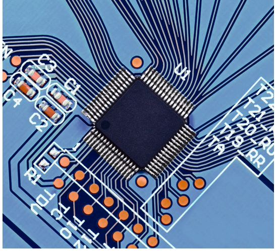

## Capital Pools / 资本池

Unlike the capital regimes that financed the shift of data to the cloud, the AI buildout requires a far tighter integration of complex and disparate financing markets. Credit wrapping uses investment-grade-rated anchors to extend financing to non-IG counterparties, blending IG cash flows with non-IG contracts to expand the universe of capital providers willing to participate—insurance, syndicated credit, private credit. A single data center platform can do something similar across the development cycle: because each stage of a buildout carries its own risk and return profile, each can be funded by the capital whose appetite fits best—private credit and equity in the early, higher-risk phases of land and construction; insurance and pension capital once the assets stabilize and yields settle.

与为数据迁移上云提供资金的资本制度不同，人工智能建设要求复杂而分散的融资市场实现更紧密整合。信用增级利用投资级评级锚点向非投资级交易对手延伸融资，将投资级现金流与非投资级合同混合，从而扩大愿意参与的资本提供者范围——包括保险资本、银团信贷和私募信贷。单一数据中心平台可以在整个开发周期采用类似方式：由于建设每个阶段各有风险收益特征，因此可由风险偏好最匹配的资本出资——在土地和施工等早期高风险阶段使用私募信贷和股权；资产稳定、收益率趋稳后使用保险和养老资本。

Capital innovation has also reached entities beyond hyperscalers alone. Leveraged finance and high-yield bond markets are now financing AI infrastructure operators whose credit profiles fall outside investment-grade thresholds—broadening the capital base supporting the buildout issuance since 2024. Applied Digital's recent $1.59 billion private offering marked the first high-yield issuance dedicated to GPU-tenanted data center infrastructure.⁴⁶

资本创新也已延伸至超大规模云服务商以外的实体。杠杆融资和高收益债券市场如今正在为信用状况低于投资级门槛的人工智能基础设施运营商融资——扩大了自 2024 年以来支持建设发行的资本基础。Applied Digital 最近完成的 15.9 亿美元私募发行，是首笔专门用于有 GPU 租户的数据中心基础设施的高收益发行。⁴⁶

### Emerging Capital Pools / 新兴资本池

<table>
<tr><td><strong>INSURANCE / 保险</strong> Long-duration liabilities require long-duration assets. The US annuity market reached a record $464 billion in 2025, doubling over five years. Regulatory changes have expanded insurers' ability to hold private infrastructure credit directly. As insurance capital continues to move into AI infrastructure at scale, the structural impact will likely rival what mortgage-backed securities did for residential real estate. 长期负债需要长期资产。2025 年美国年金市场创下 4,640 亿美元纪录，五年内翻了一番。监管变化扩大了保险公司直接持有私募基础设施信贷的能力。随着保险资本继续大规模进入人工智能基础设施，其结构性影响可能媲美抵押贷款支持证券对住宅房地产的影响。 <em>Source: LIMRA, Final U.S. Retail Annuity Sales 2025 Results, March 2026. 来源：LIMRA，《2025 年美国零售年金销售最终结果》，2026 年 3 月。</em></td><td><strong>SOVEREIGN WEALTH / 主权财富</strong> Sovereign capital has emerged as a newly activated pool of cross-border, government-backed financing specifically mobilized to address critical supply chain vulnerabilities in AI, defense, and electrification. With no redemption risk and horizons extending across decades, this pool of capital can strategically access AI infrastructure through platform acquisition rather than greenfield development. 主权资本已成为新近激活的跨境政府支持融资池，专门用于应对人工智能、国防和电气化领域的关键供应链脆弱性。由于不存在赎回风险且投资期限长达数十年，这类资本池可以通过收购平台而非绿地开发，战略性进入人工智能基础设施。</td></tr>
</table>

> "The scale of the AI buildout exceeds what traditional bank lending and public capital markets could previously efficiently finance, but that's now quickly evolving."
>
> “人工智能建设规模超过了传统银行贷款和公开资本市场过去能够高效融资的范围，但这种情况如今正在迅速变化。”
>
> **Christina Minnis | Global Head of the Alternatives Origination Group, Global Head of Credit and Asset Finance, and Head of Global Acquisition Finance within the Capital Solutions Group**
>
> **克里斯蒂娜·明尼斯｜另类资产发起集团全球主管、信贷与资产融资全球主管、资本解决方案集团全球收购融资主管**

## Capital Solutions at the Center / 资本解决方案居于核心

Goldman Sachs Capital Solutions Group, formed in early 2025, brings the firm's full financing capabilities under one umbrella—integrating the world's leading advisory franchise, a premier origination business, and a global investing platform that deploys capital across both liquid and alternative asset classes.

高盛资本解决方案集团成立于 2025 年初，将公司的全部融资能力纳入统一平台——整合全球领先的顾问业务、一流的发行业务，以及在流动性资产与另类资产类别中部署资本的全球投资平台。

The group's mandate is broad by design: to originate, structure, and distribute complex financing solutions across the entire capital stack, for any client and any sector where the financing challenge exceeds what a single instrument or balance sheet can solve.

该集团的职责在设计上十分广泛：针对任何客户、任何行业，只要融资挑战超出单一工具或资产负债表所能解决的范围，就在整个资本栈中发起、设计并分销复杂融资解决方案。

That operating system is precisely what the AI economy now demands. The buildout draws on capital pools, structuring expertise, and regulatory frameworks that previous tech transitions never needed to engage simultaneously. And as dedicated infrastructure funds scale their data center platforms, Goldman Sachs advises and finances the development of those facilities and the broader ecosystems forming around them—land, power, and the structured capital that ties them together.

这一操作系统正是人工智能经济当下所需要的。建设工作调用了以往技术转型从未需要同时接触的资本池、结构设计专长和监管框架。随着专门的基础设施基金扩大其数据中心平台，高盛为这些设施及其周边形成的更广泛生态系统——土地、电力以及将其连接起来的结构化资本——提供开发顾问和融资服务。

> "The next 12 to 24 months will be defined by an unprecedented combination of complexity and scale. Meeting that moment will require a truly diversified platform—one that spans the entirety of the capital structure and seamlessly integrates equity, debt, and structured solutions."
>
> “未来 12 至 24 个月将由前所未有的复杂性与规模组合所定义。应对这一时刻需要一个真正多元化的平台——覆盖整个资本结构，并无缝整合股权、债务和结构化解决方案。”
>
> **Mahesh Saireddy | Global Co-Head of the Capital Solutions Group**
>
> **马赫什·赛雷迪｜资本解决方案集团全球联席主管**

## The Emerging M&A Frontier / 新兴并购前沿

The nexus between technology and energy also defines an emerging M&A frontier. Hyperscaler commitments to nuclear power, data center developer investment in grid infrastructure, and industrial company deployment of AI-driven energy optimization are converging toward a deal category that sits at the intersection of technology M&A and energy infrastructure investment.

技术与能源的连接点也定义了一个新兴并购前沿。超大规模云服务商对核电的承诺、数据中心开发商对电网基础设施的投资，以及工业企业部署人工智能驱动的能源优化，正汇聚成一个位于科技并购与能源基础设施投资交叉点的交易类别。

Illustrating this point: in May 2026, NextEra Energy announced an all-stock acquisition of Dominion Energy at an enterprise value of $120 billion+, which would create the largest regulated electric utility in the United States—a consolidation offering the combined company more ways to grow and scale—with a focus on meeting surging demand and keeping bills affordable.⁴⁷

一个例证是：2026 年 5 月，NextEra Energy 宣布以全股票方式收购 Dominion Energy，企业价值超过 1,200 亿美元；这将创建美国最大的受监管电力公用事业公司。这项整合让合并后的公司拥有更多增长和扩大规模的方式，同时重点满足激增的需求并维持可负担的账单。⁴⁷

> “AI has become a tremendous tailwind for dealmaking and the equity markets more broadly, creating a cascading impact across more traditional industries.”
>
> “人工智能已成为交易活动和更广泛股权市场的巨大顺风，并在更多传统行业产生级联影响。”
>
> **Matt McClure | Global Co-Head of Investment Banking**
>
> **马特·麦克卢尔｜投资银行全球联席主管**

## Geopolitical Capital as a Strategic Lever / 地缘政治资本作为战略杠杆

The AI economy is deeply intertwined with geopolitics—ushering in an era of “instrumental capital.” Increasingly, governments, including the United States, back domestic champions in pursuit of geostrategic objectives like supply chain diversification. After China responded to the Trump administration's tariffs with export controls on rare earths, the Department of Defense introduced an equity investment in MP Materials in July 2025, with offtake commitments for rare earth magnets.⁴⁸ In October 2025, the Department of Energy took an equity stake via company warrants with Lithium Americas, structured against an existing $2.23 billion ATVM loan.⁴⁹ Serra Verde's February 2026 transaction extended the pattern—financing a Brazilian critical-minerals mine with $565 million from the US International Development Finance Corporation and a 15-year offtake agreement to a US-government-capitalized special purpose vehicle and price floors on rare earth elements.⁵⁰

人工智能经济与地缘政治深度交织——开启了“工具性资本”时代。包括美国在内的政府越来越多地支持本土冠军企业，以追求供应链多元化等地缘战略目标。中国以稀土出口管制回应特朗普政府关税后，美国国防部于 2025 年 7 月对 MP Materials 进行股权投资，并附带稀土磁体承购承诺。⁴⁸ 2025 年 10 月，美国能源部通过公司认股权证取得 Lithium Americas 的股权，其结构以现有 22.3 亿美元 ATVM 贷款为基础。⁴⁹ Serra Verde 于 2026 年 2 月的交易延续了这一模式——美国国际开发金融公司提供 5.65 亿美元，为巴西关键矿产矿山融资；同时与由美国政府资本化的特殊目的载体签订 15 年承购协议，并为稀土元素设定价格下限。⁵⁰

These represent an emerging category of geopolitical capital: cross-border sourcing with government financial support, focused on the supply chain vulnerabilities that AI, defense, and electrification expose. For now, the category is producing a steady transaction cadence, with numerous signings over the past 18 months—each using a different government instrument for a closely related strategic objective. Perhaps most ambitiously, the Export-Import Bank's Project Vault extends a $10 billion direct loan and crowding in private capital to launch a strategic critical minerals reserve.⁵¹ The Development Finance Corporation and the Pentagon's Office of Strategic Capital have also expanded their authority and broadened critical-minerals and advanced-manufacturing supply mandates.

这些交易代表一种新兴的地缘政治资本类别：在政府金融支持下进行跨境采购，重点应对人工智能、国防和电气化暴露出的供应链脆弱性。目前，该类别保持稳定的交易节奏，过去 18 个月已签署多项协议——每项都为密切相关的战略目标使用不同的政府工具。最具雄心的或许是进出口银行的 Project Vault：提供 100 亿美元直接贷款并吸引私人资本，以建立战略关键矿产储备。⁵¹ 美国国际开发金融公司和五角大楼战略资本办公室也扩大了权限，并拓宽关键矿产和先进制造供应任务。

Meanwhile, sovereigns are approaching AI on two simultaneous tracks. Externally, sovereign wealth funds continue to commit large amounts of capital to global data center, semiconductor, and HPC infrastructure assets—deploying through direct ownership, JVs, and fund commitments—with compute sovereignty increasingly driving deal rationale alongside financial returns. Domestically, governments are standing up dedicated AI vehicles, including local AI hub commitments, support for domestic champions, technology transfer provisions, and co-investment rights alongside the capital. MENA SWFs account for 40% of global sovereign wealth fund dealmaking, and within that, AI and digital infrastructure is becoming a dominant thematic. Announced capital commitments across the UAE and Saudi vehicles alone exceed $300 billion in stated targets to date.⁵²

与此同时，主权国家正沿两条轨道同时布局人工智能。对外，主权财富基金继续向全球数据中心、半导体和高性能计算基础设施资产投入大量资本——通过直接持有、合资企业和基金承诺进行部署；除财务回报外，算力主权越来越成为交易逻辑的驱动力。对内，政府正在设立专门的人工智能载体，包括对本地人工智能枢纽的承诺、对本土冠军企业的支持、技术转让条款，以及与资本配套的共同投资权。中东和北非主权财富基金占全球主权财富基金交易活动的 40%，其中人工智能和数字基础设施正成为主导主题。仅阿联酋和沙特各载体迄今公布的目标资本承诺就超过 3,000 亿美元。⁵²

For those making AI infrastructure investments, the geopolitical dimension has become central, shaping which geographies are financeable, which partnerships are permissible, and which supply chains are secure. These strategic decisions increasingly operate across shifting geographies and navigate evolving regulatory frameworks—including CHIPS, Inflation Reduction Act, semiconductor and rare earths export controls, and China's domestic AI framework.

对于人工智能基础设施投资者而言，地缘政治维度已成为核心因素，决定哪些地区可以融资、哪些合作关系获准，以及哪些供应链安全。这些战略决策越来越需要跨越不断变化的地域格局，并应对持续演进的监管框架——包括《芯片法案》《通胀削减法案》、半导体和稀土出口管制，以及中国国内人工智能框架。

> “The AI era demands a greater level of conviction, at greater speed, and across a more fragmented competitive landscape, than prior transformational periods.”
>
> “与以往转型时期相比，人工智能时代要求在更加碎片化的竞争格局中，以更快速度展现更强信念。”
>
> **Kim Posnett | Global Co-Head of Investment Banking**
>
> **金·波斯内特｜投资银行全球联席主管**

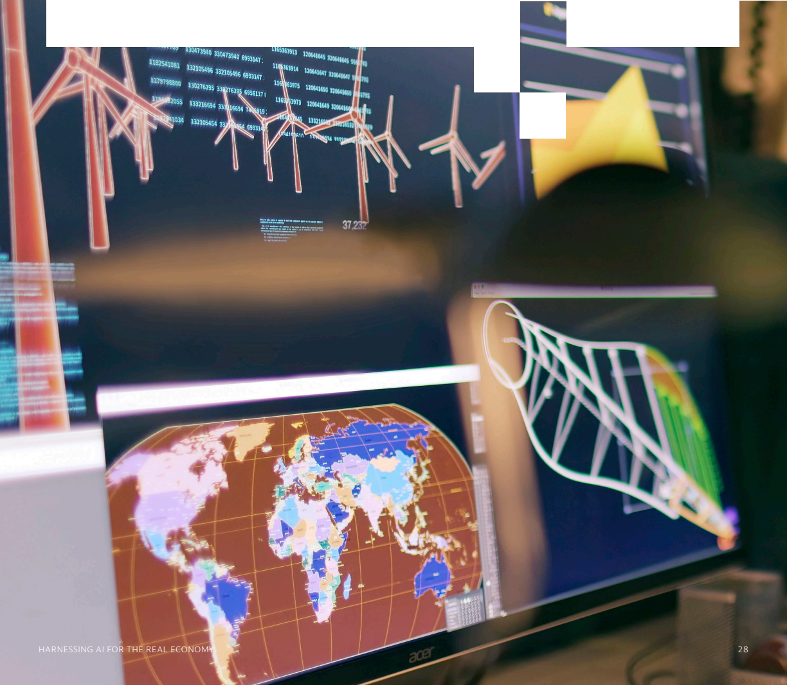

## The Decisive Variable / 决定性变量

As we physically build the AI era, it is rapidly forming a new industrial economy in real time. Leaders need strategic vision and decisive capital strategy. Funding this transformation requires the full capital stack—equity, public and private debt, sovereign capital, and new structures still being invented. It is happening across the digital and physical economy simultaneously, and at a scale and speed no prior transition has matched.

随着我们在物理世界建设人工智能时代，一种新工业经济正在实时快速形成。领导者需要战略远见和果断的资本战略。为这场转型融资需要完整资本栈——股权、公开与私人债务、主权资本，以及仍在发明中的新结构。转型正同时发生于数字经济和实体经济，其规模和速度都是以往任何转型无法比拟的。

Goldman Sachs has partnered with the leading companies behind major industrial transformations for decades, and we approach this one with the same commitment to our clients: aligning our capital, our expertise, and our strategic guidance with our clients' ambitions to reshape industries and the global economy.

数十年来，高盛一直与重大工业转型背后的领先企业合作；面对本轮转型，我们对客户秉持同样承诺：让我们的资本、专业能力和战略指导，与客户重塑行业和全球经济的雄心保持一致。

We operate everywhere this competition unfolds, advising clients on the structural decisions and nuances that geopolitical complexity demands. We built our preeminent Investment Banking business on a culture of enduring partnerships and a commitment to exceptional execution—helping clients seize new opportunities to unlock growth and transformation.

我们在这场竞争展开的每个地方开展业务，就地缘政治复杂性所要求的结构性决策和细微考量为客户提供建议。我们以持久合作的文化和追求卓越执行的承诺，打造了领先的投资银行业务——帮助客户抓住新机遇，释放增长与转型潜力。

Most of the capital that will define the AI economy has not yet been deployed, most of the M&A that will shape the competitive landscape has not yet happened, and most of the infrastructure has not yet been built. The decisions of the next three to five years will set the architecture of the AI economy for a generation. The institutions that source the capital, price the risk, and structure deals across sectors will shape the outcome. The questions those decisions answer will define the next decade.

定义人工智能经济的大部分资本尚未部署，塑造竞争格局的大部分并购尚未发生，大部分基础设施也尚未建成。未来三至五年的决策将为一代人确立人工智能经济的架构。能够筹集资本、为风险定价并跨行业设计交易结构的机构，将塑造最终结果。这些决策所回答的问题将定义未来十年。

# Appendix · Global Investment Banking Leadership and Contributors / 附录 · 全球投资银行领导团队与贡献者

**MATT MCCLURE / 马特·麦克卢尔**

Global Co-Head of Investment Banking / 投资银行全球联席主管

**ANTHONY GUTMAN / 安东尼·古特曼**

Global Co-Head of Investment Banking; Co-CEO of Goldman Sachs International / 投资银行全球联席主管；高盛国际联席首席执行官

**KIM POSNETT / 金·波斯内特**

Global Co-Head of Investment Banking / 投资银行全球联席主管

**PETE LYON / 皮特·莱昂**

Global Co-Head of the Capital Solutions Group / 资本解决方案集团全球联席主管

**MAHESH SAIREDDY / 马赫什·赛雷迪**

Global Co-Head of the Capital Solutions Group / 资本解决方案集团全球联席主管

## Contributors / 贡献者

STEPHAN FELDGOISE CHRISTINA MINNIS RAGHAV MALIAH MARK SORRELL VIVEK BANTWAL IAIN DRAYTON GERALDINE KEEFE ANDRE KELLENERS JUNG MIN KATRIEN CARBONEZ SEAN FAN JOHN GREENWOOD / 斯蒂芬·费尔德戈伊斯、克里斯蒂娜·明尼斯、拉格哈夫·马利亚、马克·索雷尔、维韦克·班特瓦尔、伊恩·德雷顿、杰拉尔丁·基夫、安德烈·凯勒纳斯、荣敏、卡特里恩·卡博内兹、肖恩·范、约翰·格林伍德

JASON TOFSKY
KYLE JESSEN
TYLER MILLER
REBECCA KRUGER
JOE PORTER
MIKE TARULLI
JOSEPH BRIGGS
BRIAN CAYNE
JACK ANSTEY
USMAN ASHRAF
EMILY BAKER
SABINA CERIC

杰森·托夫斯基、凯尔·杰森、泰勒·米勒、丽贝卡·克鲁格、乔·波特、迈克·塔鲁利、约瑟夫·布里格斯、布赖恩·凯恩、杰克·安斯蒂、乌斯曼·阿什拉夫、艾米莉·贝克、萨比娜·塞里奇

VIVEK KAGZI
DAN KEYSERLING
ALEX LAURN
ERIC LIU
MATT MARGOLIN
MEGAN MILLER
BEN NALE
BENNY PINKAS
MARCO POLETTI
JOHN SALES
MICHAEL SANTIAGO
LARKYN SINCLAIR

维韦克·卡格齐、丹·凯瑟林、亚历克斯·劳恩、埃里克·刘、马特·马戈林、梅根·米勒、本·内尔、本尼·平卡斯、马尔科·波莱蒂、约翰·塞尔斯、迈克尔·圣地亚哥、拉金·辛克莱

ERIK SPARKS KARTHIK SUBRAMANIAN HEATHER AHOLT BRANDON BAUER SPENCER CHENG MILA MILATOVIC DAMIEN PETZOLD WILSON SHIRLEY CAROLINE BROOKS JAMIE CATHERWOOD ELLA PEPPER ETHAN CHOI / 埃里克·斯帕克斯、卡尔蒂克·苏布拉马尼安、希瑟·阿霍尔特、布兰登·鲍尔、斯宾塞·程、米拉·米拉托维奇、达米安·佩措尔德、威尔逊·雪莉、卡罗琳·布鲁克斯、杰米·卡瑟伍德、埃拉·佩珀、伊森·崔

LAURA CYR
ERICK MARTINEZ
ADAIR NGUYEN
LAUREN MILLER
GEORGE BERGER
CHRIS CROSSEN
CLAIRE CROZIER
CHRIS FREYER
JESSICA TILL
SCOTT LYLES

劳拉·西尔、埃里克·马丁内斯、阿代尔·阮、劳伦·米勒、乔治·伯杰、克里斯·克罗森、克莱尔·克罗泽、克里斯·弗赖尔、杰西卡·蒂尔、斯科特·莱尔斯

# Endnotes / 尾注

¹Goldman Sachs Global Institute, "Tracking Trillions: The Assumptions Shaping the Scale of the AI Build-Out," April 2026.

¹高盛全球研究院，《追踪数万亿美元：塑造人工智能建设规模的假设》，2026 年 4 月。

²Datastream, Factset, Goldman Sachs Global Investment Research, "The AI Spending Boom Is Not Too Big," October 2025.

²Datastream、FactSet、高盛全球投资研究，《人工智能支出热潮并非过大》，2025 年 10 月。

³ Powering the AI Era, Goldman Sachs Investment Banking, 2025.

³《为人工智能时代供能》，高盛投资银行，2025 年。

⁴ Powering the AI Era, Goldman Sachs Investment Banking, 2025.

⁴《为人工智能时代供能》，高盛投资银行，2025 年。

⁵ Powering the AI Era, Goldman Sachs Investment Banking, 2025.

⁵《为人工智能时代供能》，高盛投资银行，2025 年。

⁶SpaceX Inks $30 Billion Computing Power Deal With Google, Bloomberg, June 5, 2026.

⁶彭博社，《SpaceX 与谷歌签署 300 亿美元算力协议》，2026 年 6 月 5 日。

⁷Precedence Research. / ⁷Precedence Research。

⁸Stanford AI Index 2026. / ⁸《斯坦福人工智能指数 2026》。

9"Predictive maintenance with generative AI: Senseye anticipates when there will be trouble at the factory," Siemens Blog, December 8, 2025.

9西门子博客，《使用生成式人工智能进行预测性维护：Senseye 预判工厂何时会出现问题》，2025 年 12 月 8 日。

10 “F.02 Contributed to the Production of 30,000 Cars at BMW,” Figure AI, November 19, 2025.

10 Figure AI，《F.02 参与宝马 3 万辆汽车的生产》，2025 年 11 月 19 日。

11 International Monetary Fund. / 11 国际货币基金组织。

¹² "Global Technology Spending Will Grow A Record 7.8% In 2026 To Reach $5.6 Trillion," Forester Report.

¹² Forester 报告，《2026 年全球技术支出将创纪录增长 7.8%，达到 5.6 万亿美元》。

¹³ Precedence Research. / ¹³ Precedence Research。

¹⁴ "Tracking Trillions: The Assumptions Shaping the Scale of the AI Build-Out," April 2026. Note: Forecasts and expectations are based on material assumptions subject to change. Assumes Nvidia accounts for 75% of total compute spend in each period. Assumes 5% YoY compute growth past the projection period (2031). Uses VR200 (Rubin) chip as baseline spec ($80.5K per GPU [incl. node costs] and 3,000 W per package) across all years. Assumes 1.2 PUE, $15mn per MW for data centers, and $2,500 per kW for new power. Assumes 15% of required data center space is brownfield (i.e., excluded from calculation) in 2026, growing to 30% in 2031. Totals may not sum due to rounding.

¹⁴《追踪数万亿美元：塑造人工智能建设规模的假设》，2026 年 4 月。注：预测和预期基于可能发生变化的重大假设。假设英伟达在每个时期占总算力支出的 75%。假设预测期（2031 年）之后算力同比增长 5%。所有年份均采用 VR200（Rubin）芯片作为基准规格（每块 GPU 8.05 万美元，含节点成本；每个封装功耗 3,000 W）。假设 PUE 为 1.2，数据中心每 MW 1,500 万美元，新建电力每 kW 2,500 美元。假设 2026 年所需数据中心空间的 15% 为棕地项目（即不计入计算），到 2031 年增至 30%。由于四舍五入，总数可能不等于各项之和。

15“Vantage Data Centers Unveils Plans for ‘Frontier,’ a $25B Mega-campus in Texas to Meet Unprecedented AI Demand,” Vantage Data Centers press release, August 19, 2025.

15 Vantage Data Centers 新闻稿，《Vantage Data Centers 公布得克萨斯州 250 亿美元“Frontier”超级园区计划，以满足前所未有的人工智能需求》，2025 年 8 月 19 日。

16 Goldman Sachs Global Investment Research, Gartner. / 16 高盛全球投资研究、Gartner。

17 First Trust NASDAQ Cybersecurity ETF (CIBR) and iShares Expanded Tech-Software Sector ETF (IGV).

17 First Trust 纳斯达克网络安全 ETF（CIBR）和 iShares 扩展科技软件行业 ETF（IGV）。

18“AI for Factories: Industrial Software Makers Dodge Market Meltdown,” Bloomberg, February 6, 2026.

18 彭博社，《工厂人工智能：工业软件制造商躲过市场崩盘》，2026 年 2 月 6 日。

19"State of AI: An Empirical 100 Trillion Token Study," OpenRouter and Andreessen Horowitz, December 2025; OpenRouter usage rankings, as of April 2026.

19 OpenRouter 与 Andreessen Horowitz，《人工智能现状：100 万亿 token 实证研究》，2025 年 12 月；OpenRouter 使用排名，截至 2026 年 4 月。

20 “AI for Factories: Industrial Software Makers Dodge Market Meltdown,” Bloomberg, February 6, 2026.

20 彭博社，《工厂人工智能：工业软件制造商躲过市场崩盘》，2026 年 2 月 6 日。

²¹Siemens press release, April 1, 2025. / ²¹西门子新闻稿，2025 年 4 月 1 日。

²² Synopsys Inc. press release, July 16, 2025. / ²²新思科技新闻稿，2025 年 7 月 16 日。

²³Emerson Electric Co. press release, March 12, 2025. / ²³艾默生电气公司新闻稿，2025 年 3 月 12 日。

²⁴ Mobileye press release, January 6, 2026. / ²⁴ Mobileye 新闻稿，2026 年 1 月 6 日。

25 Prometheus, Series B financing announcement, June 11, 2026; public records.

25 Prometheus，B 轮融资公告，2026 年 6 月 11 日；公开记录。

²⁶ Goldman Sachs Global Investment Research, Part II: Humanoids and Profit Implications for Autos, October 2025.

²⁶高盛全球投资研究，《第二部分：人形机器人及其对汽车行业利润的影响》，2025 年 10 月。

27 Cat® Autonomy Solutions, January 7, 2026. / 27 Cat® 自主解决方案，2026 年 1 月 7 日。

28 "Amazon unveils the next generation of fulfillment centers,"
aboutamazon.com,October 9, 2024.

28 aboutamazon.com，《亚马逊发布下一代履约中心》，2024 年 10 月 9 日。

²⁹Goldman Sachs Global Investment Research, China Humanoid Robot—Mid-Year Check-In: Several Steps Closer Toward Commercial Reality, May 26, 2026; public records on Chinese humanoid robotics deployments (Unitree, XPENG, Fourier).

²⁹高盛全球投资研究，《中国人形机器人——年中检视：距离商业现实又近了几步》，2026 年 5 月 26 日；中国人形机器人部署（宇树科技、小鹏、傅利叶）的公开记录。

30 "Galbot Raises $362 Million in Fresh Funding, Eyes Hong Kong IPO," Caixin Global, March 3, 2026.

30 财新国际，《银河通用新融资 3.62 亿美元，考虑香港 IPO》，2026 年 3 月 3 日。

³¹ Global Market Insights, Military Drone Market, January 2026. / ³¹ Global Market Insights，《军用无人机市场》，2026 年 1 月。

32 Google Public Sector press release, July 14, 2025. / 32 Google Public Sector 新闻稿，2025 年 7 月 14 日。

33 "Anduril Announces $5B Series H Raise," Anduril press release, May 13, 2026.

33 Anduril 新闻稿，《Anduril 宣布完成 50 亿美元 H 轮融资》，2026 年 5 月 13 日。

³⁴ "Helsing raises €600m to invest in European technological sovereignty," Helsing press release, June 17, 2025.

³⁴ Helsing 新闻稿，《Helsing 融资 6 亿欧元，投资欧洲技术主权》，2025 年 6 月 17 日。

35“PhysicsX Announces $300M Series C to Accelerate Physics AI for Industrial Engineering,” PhysicsX press release, June 8, 2026.

35 PhysicsX 新闻稿，《PhysicsX 宣布 3 亿美元 C 轮融资，加速工业工程物理人工智能》，2026 年 6 月 8 日。

36 Goldman Sachs SUSTAIN, Goldman Sachs Global Investment Research,February 5, 2026.

36 高盛 SUSTAIN、高盛全球投资研究，2026 年 2 月 5 日。

37 INNIO IPO pricing press release, June 3, 2026. / 37 INNIO IPO 定价新闻稿，2026 年 6 月 3 日。

³⁸Goldman Sachs Global Institute, “Securing and Financing the Future of Water,” May 14, 2026.

³⁸高盛全球研究院，《保障水资源未来并为其融资》，2026 年 5 月 14 日。

³⁹Goldman Sachs Global Investment Research, US Power Demand Update,January 2026.

³⁹高盛全球投资研究，《美国电力需求更新》，2026 年 1 月。

⁴⁰ Alphabet equity raise, June 2026; public records. / ⁴⁰ Alphabet 股权融资，2026 年 6 月；公开记录。

⁴¹Bloomberg, Dealogic, Goldman Sachs estimates as of June 2023. / ⁴¹彭博社、Dealogic、高盛估算，截至 2023 年 6 月。

⁴²Bloomberg,Dealogic,Goldman Sachs estimates as of June 2023. / ⁴²彭博社、Dealogic、高盛估算，截至 2023 年 6 月。

⁴³ Goldman Sachs Global Investment Research, "Private Markets Are Expected to Have a Growing Role in Data Center Financing," June 12, 2026.

⁴³高盛全球投资研究，《预计私募市场将在数据中心融资中发挥越来越大的作用》，2026 年 6 月 12 日。

⁴⁴ Meta Platforms/Blue Owl Capital, Hyperion data center financing via Beignet Investor LLC, October 2025.

⁴⁴ Meta Platforms/Blue Owl Capital，通过 Beignet Investor LLC 为 Hyperion 数据中心融资，2025 年 10 月。

⁴⁵Goldman Sachs Credit Strategy Research, April 2026. / ⁴⁵高盛信贷策略研究，2026 年 4 月。

⁴⁶“Applied Digital Announces Pricing of $1.59 Billion of Senior Secured Notes to Fund the Fourth Building at Polaris Forge 1,” Applied Digital press release, June 9, 2026.

⁴⁶ Applied Digital 新闻稿，《Applied Digital 宣布为 Polaris Forge 1 第四栋建筑融资的 15.9 亿美元高级担保票据定价》，2026 年 6 月 9 日。

⁴⁷“NextEra Energy and Dominion Energy to Combine, Creating the World's Largest Regulated Electric Utility Business and North America's Premier Energy Infrastructure Platform Benefiting Customers,” NextEra Energy press release, May 18, 2026.

⁴⁷ NextEra Energy 新闻稿，《NextEra Energy 与 Dominion Energy 合并，创建全球最大受监管电力公用事业业务及造福客户的北美领先能源基础设施平台》，2026 年 5 月 18 日。

⁴⁸ MP Materials-Department of Defense preferred-equity investment, July 2025.

⁴⁸ MP Materials 与美国国防部优先股投资，2025 年 7 月。

⁴⁹ Lithium Americas-Department of Energy ATVM loan restructuring and equity warrants via the Thacker Pass JV with GM, October 2025.

⁴⁹ Lithium Americas 与美国能源部通过和通用汽车的 Thacker Pass 合资企业进行 ATVM 贷款重组和股权认股权证安排，2025 年 10 月。

⁵⁰Serra Verde-US International Development Finance Corporation financing package,February 6, 2026.

⁵⁰ Serra Verde 与美国国际开发金融公司融资方案，2026 年 2 月 6 日。

⁵¹“EXIM Approves Project Vault Loan to Launch America's Strategic Critical Minerals Reserve and Support Manufacturing Jobs,” Export-Import Bank of the United States, February 2, 2026; “America’s New Critical Minerals Playbook,” Jared Cohen (Goldman Sachs), Time Magazine, June 15, 2026.

⁵¹美国进出口银行，《EXIM 批准 Project Vault 贷款，以启动美国战略关键矿产储备并支持制造业就业》，2026 年 2 月 2 日；贾里德·科恩（高盛），《美国关键矿产新打法》，《时代》杂志，2026 年 6 月 15 日。

⁵² Global SWF, 2026 Annual Report: State-Owned Investors—From Scale to Strategy, January 2026.

⁵² Global SWF，《2026 年年度报告：国有投资者——从规模到战略》，2026 年 1 月。

# Disclaimer / 免责声明

This paper has been prepared by Goldman Sachs Investment Banking for informational purposes and is not a product of Goldman Sachs Global Investment Research. This paper, in whole or in part, should not be copied, published, reproduced or otherwise duplicated, or be distributed or otherwise disseminated to any other person. This paper does not purport to contain a comprehensive overview of Goldman Sachs’ products and offerings and may differ from the views and opinions of other departments or segments of Goldman Sachs and its affiliates.

本文件由高盛投资银行编制，仅供参考，并非高盛全球投资研究的产品。本文件无论全部或部分，均不得复制、出版、再制作或以其他方式复刻，也不得向任何其他人士分发或以其他方式传播。本文件无意全面概述高盛的产品与服务，其内容可能与高盛及其关联公司的其他部门或业务板块的观点和意见不同。

This paper should not be used as a basis for trading in the securities or loans of any company, including those named herein, or for any other investment decision, and it does not constitute an offer of solicitation with respect to the securities or loans of any company, including those named herein, or a solicitation of proxies or votes and should not be construed  as consisting of investment advice.

本文件不应作为交易任何公司（包括本文提及的公司）证券或贷款的依据，也不应作为任何其他投资决策的依据；本文件不构成对任何公司（包括本文提及的公司）证券或贷款的要约招揽，也不构成对代理权或投票的征集，且不应被解释为投资建议。

Unless otherwise indicated herein, this paper has been prepared using, and is based on, information obtained by us from publicly available sources. In preparing this paper, we have applied certain assumptions and have relied upon and assumed, without assuming any responsibility for independent verification, the accuracy and completeness of all financial, legal, regulatory, tax, accounting and other information provided to, discussed with or reviewed by us. This paper is necessarily based on economic, monetary, market and other conditions as  in effect on, and the information made available to us as of, the dates indicated herein and we assume no responsibility for updating or revising this paper.

除非本文另有说明，本文件使用并基于我们从公开来源获得的信息编制。在编制本文件时，我们采用了若干假设，并依赖且假定向我们提供、与我们讨论或由我们审阅的所有财务、法律、监管、税务、会计及其他信息准确完整，但不承担独立核实责任。本文件必然基于本文所示日期当时有效的经济、货币、市场及其他条件，以及截至该等日期可供我们使用的信息；我们不承担更新或修订本文件的责任。

Goldman Sachs is not providing any financial, economic, investment, accounting, tax, or legal advice through this paper or to its recipients. Neither Goldman Sachs nor any of its affiliates  makes any representation or warranty, express or implied, as to the accuracy or completeness of the statements or any information contained in this paper and any liability therefore (including in respect of direct, indirect, or consequential loss or damage) is expressly disclaimed.

高盛不通过本文件或向其接收者提供任何财务、经济、投资、会计、税务或法律建议。高盛及其任何关联公司均不对本文件所载陈述或任何信息的准确性或完整性作出任何明示或默示的陈述或保证，并明确否认由此产生的任何责任（包括直接、间接或后果性损失或损害）。

© 2026 Goldman Sachs. All rights reserved. / © 2026 高盛。保留所有权利。

Goldman Investment Sachs Banking / 高盛投资银行

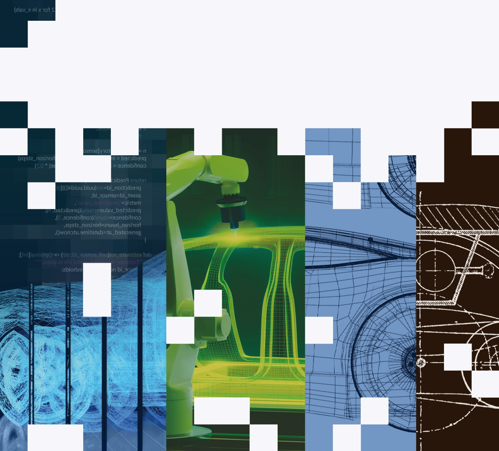
