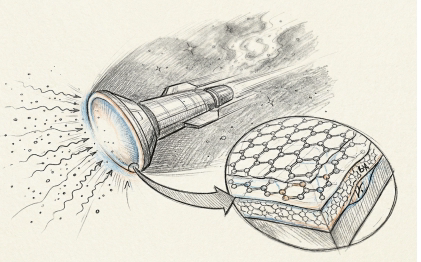
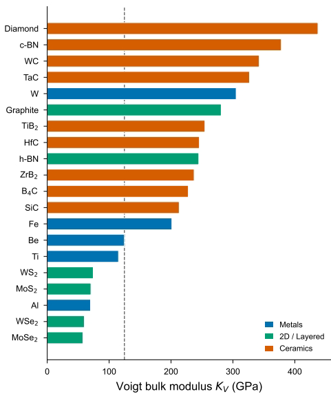
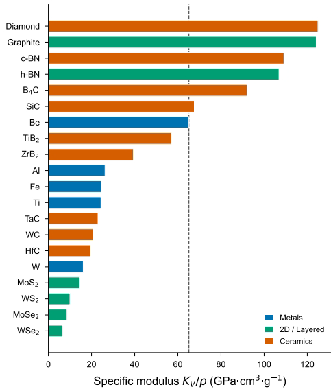
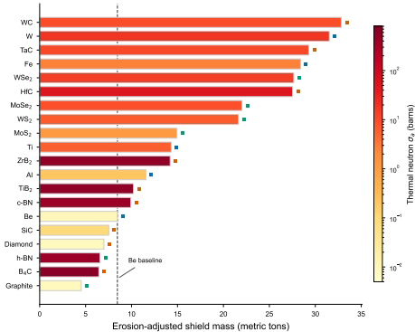
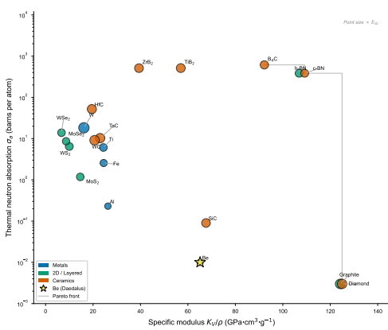
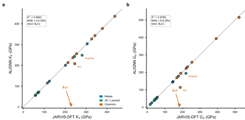
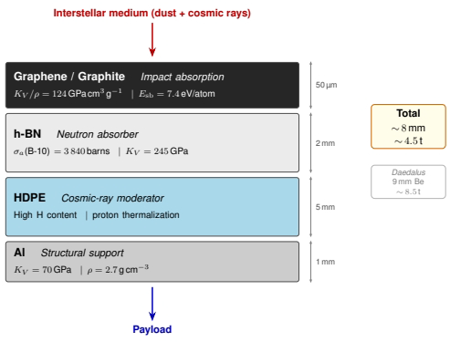

<!-- "type": "page-number", "value": 0 -->
arXiv:2604.00571v1 [cond-mat.mtrl-sci] 1 Apr 2026

#   Beyond Beryllium: AI-Accelerated Materials Discovery for Interstellar Spacecraft Shielding

Yue Li, $^{1}$ Xu Pan, $^{2}$ and Kaiyuan Guo $^{3}$

$^{1}$School of Materials Science and Engineering, Nanyang Interstellar University, Singapore 639798, Singapore

$^{2}$School of Artificial Intelligence, Nanyang Interstellar University, Singapore 639798, Singapore

$^{3}$Department of Medical Radiation Management and Hibernation, Shanghai Interstellar Jiao Tong University, Shanghai 200240, China

(Dated: April 1, 2026)

Project Daedalus (1973–1978), the most detailed interstellar probe design study ever conducted, specified a 9 mm beryllium erosion shield to protect the spacecraft payload during its 5.9 light-year cruise to Barnard's Star at 12% of the speed of light. This design, however, predated both the isolation of two-dimensional materials and the development of graph neural network (GNN) property predictors. Here, we systematically screen 20 candidate materials—spanning conventional aerospace metals, transition metal dichalcogenides, and ultra-high-temperature ceramics—using density functional theory (DFT) data from the JARVIS database (76,000 materials) with independent validation by the Atomistic Line Graph Neural Network (ALIGNN). We evaluate candidates across four criteria: specific mechanical stiffness ($K_V/\rho$), sputtering resistance, thermal neutron absorption cross-section, and thermodynamic stability. Our screening identifies hexagonal boron nitride (h-BN) and boron carbide ($B_4C$) as dual-function materials offering simultaneous mechanical protection and neutron radiation shielding, and we propose a graphene/h-BN/polymer layered heterostructure shield design that achieves an estimated 47% mass reduction relative to the original beryllium specification. These findings will become immediately actionable upon the successful development of fusion pulse propulsion, which we note remains an outstanding engineering challenge.

# Table of Contents Graphic: An interstellar probe encounters the ISM at 0.12c. Inset: layered heterostructure shield with graphene and h-BN nanostructures.

#   INTRODUCTION

The prospect of interstellar travel has motivated some of the most ambitious engineering studies in human history. In 1968, Dyson [1] articulated the fundamental energetics of interstellar transport, establishing that nuclear pulse propulsion could in principle accelerate a spacecraft to a significant fraction of the speed of light.

Project Orion (1958–1965) explored nuclear pulse propulsion using fission bombs before being curtailed by the Partial Test Ban Treaty [2]. The most comprehensive design study to date, Project Daedalus (1973–1978), proposed an unmanned probe propelled by inertial confinement fusion to reach Barnard's Star, 5.9 light-years distant, at a cruise velocity of 0.12c [3]. More recently, Project Icarus has sought to update the Daedalus concept with modern engineering knowledge [4].

A critical and often underappreciated challenge of relativistic spaceflight is the bombardment of the spacecraft by interstellar medium (ISM) particles. At 0.12c (3.6 × 10$^{7}$ m/s), even the tenuous ISM becomes a formidable particle beam. Martin's analysis for the Daedalus study [5] showed that over a 5.9 light-year transit through a region with particle density n ≈ 1 cm $^{-3}$, the frontal shield (area A ≈ 491 m$^{2}$) would encounter ≈ 2.7 × 10$^{25}$ particles, with individual protons carrying kinetic energies of ~6.7 MeV—well into the nuclear reaction regime. Larger dust grains, though far rarer, can deliver megajoule-scale impacts equivalent to macroscopic explosions [6, 7].

The Daedalus team's solution was a 9 mm beryllium erosion shield, selected for its combination of low density ($\rho = 1.85$ g/cm$^3$), reasonable bulk modulus ($K_V \approx 115$ GPa), and high sublimation energy ($E_{sb} = 3.36$ eV/atom) [3, 5]. However, this design was constrained to the materials knowledge of the 1970s. In the intervening half-century, materials science has undergone transformative advances: the isolation and characterization of two-dimensional materials beginning with graphene in 2004 [8]; the development of ultra-high-

<!-- "type": "page-number", "value": 1 -->
2

temperature ceramics (UHTCs) with extreme mechanical properties [9]; and the discovery that boron-containing materials provide exceptional neutron radiation shielding [10–13].

Equally transformative has been the rise of computational materials screening. The JARVIS (Joint Automated Repository for Various Integrated Simulations) database now contains density functional theory (DFT) calculations for over 76,000 materials [14], while graph neural network architectures such as the Atomistic Line Graph Neural Network (ALIGNN) enable rapid property prediction with near-DFT accuracy [15–17].

In this work, we leverage the JARVIS-DFT database and ALIGNN pretrained models to systematically re-evaluate the materials selection for interstellar dust shielding. We screen 20 candidate materials across three families—conventional aerospace metals, layered/two-dimensional materials, and ceramics/superhard compounds—against four performance metrics relevant to the Daedalus mission profile. We identify several materials that substantially outperform beryllium, propose a layered heterostructure shield concept, and discuss the implications for future interstellar mission design.

#   METHODS

##   Mission Parameters

We adopt the Daedalus Phase 2 mission profile [3]: cruise velocity $v = 0.12c = 3.6 \times 10^7$ m/s, distance to Barnard's Star $d = 5.9$ ly = $5.58 \times 10^{16}$ m, yielding a cruise time of ~49 years. The shield is modeled as a circular disk of radius $R = 12.5$ m (matching the Daedalus second stage diameter of 25 m), giving a frontal area $A = \pi R^2 \approx 491$ m $^{2}$.

The local ISM is modeled with particle number density $n = 1 \text{ cm}^{-3} (= 10^6 \text{ m}^{-3})$ and mean particle mass $\bar{m} = 1.29$ amu, appropriate for a hydrogen-dominated medium with ~10% helium by number. The total fluence on the shield surface over the mission is:

$$ \Phi = n \cdot d = 5.58 \times 10^{18} \text{ particles/cm}^2 \quad (1) $$

At 0.12c, the kinetic energy of a single proton is $E_p = \frac{1}{2}m_p v^2 \approx 6.7$ MeV (non-relativistic approximation; the Lorentz factor $\gamma = 1.0072$ introduces a <1% correction). This energy substantially exceeds typical sputtering thresholds (~10–100 eV) and surface binding energies (~3–9 eV), placing the bombardment firmly in the high-energy sputtering regime.

##   Material Screening Criteria

We evaluate each candidate material against four criteria:

(i) Specific mechanical stiffness, quantified by the ratio $K_V/\rho$ (GPa·cm $^{3}$/g), where $K_V$ is the Voigt bulk modulus and $\rho$ is the mass density. This metric captures the ability to resist mechanical deformation per unit mass—critical for minimizing shield mass while maintaining structural integrity under impact loading. We note that the Voigt average represents an upper bound on the true polycrystalline bulk modulus; for highly anisotropic layered materials (graphite, h-BN), this average includes the very stiff in-plane elastic constants and thus substantially exceeds the soft out-of-plane response. The Reuss (lower) bound for these materials would be significantly lower. Both bounds are reported where relevant.

(ii) Sputtering resistance, parameterized by the surface binding energy $E_{sb}$ (eV/atom). In the high-energy limit relevant to 0.12c bombardment, the sputtering yield scales approximately as $Y \propto 1/E_{sb}$ [18]. We employ a simplified model:

$$ Y = Y_{\text{ref}} \cdot \frac{E_{\text{ref}}}{E_{\text{sh}}} \quad (2) $$

with $Y_{ref} = 3$ atoms/ion at $E_{ref} = 4$ eV, consistent with the high-energy limiting behavior reported for metallic targets [18].

(iii) Thermal neutron absorption cross-section $\sigma_a$ (barns). While the primary ISM bombardment consists of fast particles, secondary neutron production within the shield itself, combined with the galactic cosmic ray background, makes neutron moderation an important secondary consideration. Materials containing boron-10 ($\sigma_a = 3,840$ barns) offer a dramatic advantage [10].

(iv) Thermodynamic stability, assessed via the energy above the convex hull ($E_{\text{hull}}$) from DFT calculations.

##   Material Data Sources

Elastic moduli ($K_V$, $G_V$), formation energies, and band gaps were obtained from the JARVIS-DFT database [14, 17], which provides DFT-computed properties using the OptB88vdW functional for over 76,000 materials. Each material is identified by a unique JVASP identifier (Table II), enabling full reproducibility. Thermal neutron cross-sections were taken from the NNDC/IAEA Nuclear Data compilation [19]. Surface binding energies were obtained from experimental sublimation enthalpy data.

As an independent validation, we performed property predictions using the ALIGNN pretrained models [15] (jv_bulk_modulus_kv_alignn and jv_shear_modulus_gv_alignn) on the same crystal

<!-- "type": "page-number", "value": 2 -->
3

structures retrieved from JARVIS. We note that beryllium is represented in the JARVIS database by its bcc phase (JVASP-14628, Im $\bar{3}$m), as the ground-state hcp phase lacks computed elastic tensor data in the current release.

#   Composite Figure of Merit

To enable single-metric ranking, we define a shield figure of merit:

$$ \text{FoM} = \frac{K_V}{\rho} \cdot E_{sb} \cdot (1 + \log_{10}(\sigma_a + 1)) \quad (3) $$

normalized such that Be = 1.0. This weighting treats mechanical performance, sputtering resistance, and neutron absorption as multiplicatively complementary properties. We note that different mission architectures may warrant alternative weightings.

#   RESULTS

#   Mechanical Properties

Figure 1 presents the Voigt bulk modulus $K_V$ and Fig. 2 the specific modulus $K_V/\rho$ for all 20 candidate materials. Among the ceramics, diamond ($K_V = 437$ GPa, JVASP-91), cubic boron nitride (c-BN, 378 GPa, JVASP-7836), tungsten carbide (WC, 342 GPa), and tantalum carbide (TaC, 327 GPa) exhibit the highest absolute stiffness. When normalized by density, diamond and graphite ($K_V/\rho \approx 125$ GPa·cm$^3$/g) dominate, followed by c-BN (109), h-BN (107), and $B_4C$ (92).

An important caveat applies to the layered materials. The JARVIS-DFT Voigt bulk moduli for graphite ($K_V = 281$ GPa, JVASP-48) and h-BN ($K_V = 245$ GPa, JVASP-62756) are substantially higher than the ~30–40 GPa values commonly cited in the literature. This discrepancy arises because the Voigt average is an upper bound that heavily weights the extremely stiff in-plane elastic constants ($C_{11} > 1,000$ GPa for graphene) while the interlayer response ($C_{33} \sim 30$–40 GPa) contributes less. The Reuss (lower) bound for these materials would be closer to the commonly cited values. For the shielding application considered here, the in-plane stiffness is arguably the more relevant metric, as dust grain impacts would load the shield primarily in-plane.

The layered transition metal dichalcogenides ($MoS_2$, $WS_2$, $MoSe_2$, $WSe_2$) exhibit uniformly low specific moduli (<15 GPa·cm$^3$/g), rendering them unsuitable as primary structural shielding materials.

# FIG. 1. Voigt bulk modulus $K_V$ of 20 candidate shielding materials (JARVIS-DFT). Dashed line: Be baseline.

#   Shield Mass Analysis

Figure 3 presents the erosion-adjusted shield mass for each material, computed by scaling the Daedalus reference thickness (9 mm) inversely with surface binding energy relative to beryllium ($E_{sb}^{Be} = 3.36$ eV), with a minimum structural thickness of 1 mm. The Daedalus beryllium erosion plate at 9 mm thickness serves as the baseline at 8.5 metric tons.

Several materials achieve significant mass reductions relative to beryllium: graphite (4.5 t, -47%), $B_4C$ (6.4 t, -24%), h-BN (6.6 t, -22%), and diamond (7.0 t, -17%). The color encoding in Fig. 3 reveals that h-BN and $B_4C$ simultaneously provide exceptional neutron absorption ($\sigma_a > 380$ barns per atom), a capability entirely absent from the beryllium baseline ($\sigma_a = 0.008$ barns).

At the other extreme, high-Z materials such as tungsten carbide (32.8 t), tungsten (31.5 t), and tantalum carbide (29.3 t) are unsuitable despite their excellent absolute mechanical properties, as their high densities translate to prohibitive shield masses.

#   Multi-Objective Screening

Figure 4 presents the two most critical performance axes—specific modulus versus thermal neutron

<!-- "type": "page-number", "value": 3 -->
4

# FIG. 2. Specific modulus $K_V/\rho$, the key mass-efficiency metric. Dashed line: Be baseline from the Daedalus design.

absorption—as a scatter plot with point size proportional to surface binding energy.

The Pareto front reveals three distinct high-performance regimes: (i) Pure mechanical excellence: diamond and graphite, with $K_V/\rho \approx 125$ but negligible neutron absorption. (ii) Balanced performance: $B_4C$ ($K_V/\rho = 92$, $\sigma_a = 614$ barns), c-BN and h-BN ($K_V/\rho \approx 107-109$, $\sigma_a = 384$ barns), and $TiB_2$ ($K_V/\rho = 57$, $\sigma_a = 513$ barns), combining strong mechanical properties with very high neutron absorption via their boron content. (iii) Radiation shielding specialists: $ZrB_2$ ($\sigma_a = 511$ barns) at moderate specific modulus.

Beryllium occupies a poor position in this space: moderate specific modulus (65) with essentially zero neutron absorption. Its selection in 1978 reflects the limited material options available, not optimization against modern multi-objective criteria.

#   ALIGNN Validation

Figure 5 presents parity plots comparing ALIGNN predictions with JARVIS-DFT values for bulk modulus $K_V$ and shear modulus $G_V$. Excluding $B_4C$, the agreement is excellent: $R^2 = 0.990$ and MAE = 4.4 GPa for $K_V$; $R^2 = 0.980$ and MAE = 6.8 GPa for $G_V$.

The B₄C outlier (JVASP-52866;ALIGNN predicts

# a

# FIG. 3. Erosion-adjusted shield mass for a 5.9 ly mission at 0.12c. Bar color indicates thermal neutron absorption cross-section (color bar, log scale). Dashed line marks the beryllium baseline (8.5 t). Colored markers indicate material family.

# FIG. 4. Multi-objective screening: specific modulus versus thermal neutron absorption cross-section. Point size is proportional to surface binding energy. Staircase line indicates the Pareto front. The gold star marks beryllium (Daedalus baseline).

$K_V = 9$ GPa versus DFT $K_V = 228$ GPa) is attributed to the structural complexity of the rhombohedral $B_{12}C_3$ unit cell (15 atoms, R$\bar{3}$m), which contains icosahedral $B_{12}$ clusters linked by C–B–C chains. This topology is rare in the ALIGNN training set, and the resulting graph representation may inadequately capture the inter-cluster bonding that governs the bulk elastic response.

<!-- "type": "page-number", "value": 4 -->
5

# FIG. 5. ALIGNN predictions versus JARVIS-DFT values for (a) $K_V$ and (b) $G_V$. $B_4C$ (inverted triangle) is an outlier due to structural complexity. Statistics exclude $B_4C$.

##   Layered Heterostructure Shield Concept

Based on our screening results, we propose a functionally graded layered shield (Fig. 6) in which each layer addresses a specific threat:

Layer 1: Graphene/graphite impact layer (~50 µm). The outermost layer exploits the extraordinary specific modulus of sp $^{2}$ carbon ($K_V/\rho = 124$ GPa·cm $^{3}$/g) and high sublimation energy (7.43 eV/atom) to absorb initial dust grain impacts and resist sputtering erosion.

Layer 2: h-BN neutron absorber (~2 mm). Hexagonal boron nitride serves dual duty: its boron-10 content ($\sigma_a = 3,840$ barns for $^{10}$B) efficiently captures secondary thermal neutrons, while its high Voigt bulk modulus ($K_V = 245$ GPa) provides mechanical reinforcement. NASA has independently validated BN-based materials for space radiation shielding [10, 12, 20].

Layer 3: HDPE cosmic ray moderator (~5 mm). High-density polyethylene, with its high hydrogen content, serves as a proton moderator for secondary cosmic ray particles, following established spacecraft shielding practice.

Layer 4: Aluminum structural support (~1 mm). A conventional aluminum backing provides structural mounting and thermal management.

The total heterostructure thickness of ~8 mm is comparable to the original 9 mm beryllium design, but the estimated total mass of ~4.5 metric tons represents a 47% reduction from the 8.5-ton beryllium baseline, while adding neutron absorption capability entirely absent from the original.

##   Figure of Merit Ranking

Table I presents the composite figure of merit for the top 10 candidates. The top-ranked materials—c-BN (FoM = 9.2), B₄C (9.1), h-BN (9.0), and TiB₂ (6.3)—all contain boron, reflecting the outsized contribution

# FIG. 6. Proposed layered heterostructure shield concept. Each layer is optimized for a specific threat: dust impact absorption (graphene/graphite), neutron capture (h-BN), cosmic ray moderation (HDPE), and structural support (Al). Total mass represents a ~47% reduction relative to the Daedalus beryllium shield.

# TABLE I. Top 10 candidate materials ranked by composite figure of merit, normalized to Be = 1.0. All $K_V$ values from JARVIS-DFT.

|Material|$K_V/\rho$|$\sigma_a$ (b)|$E_{\text{sb}}$ (eV)|Mass (t)|FoM|
|---|---|---|---|---|---|
|c-BN|109.2|384|5.18|9.9|9.2|
|$B_{4}C$|92.2|614|5.70|6.4|9.1|
|h-BN|106.9|384|5.18|6.6|9.0|
|$TiB_{2}$|57.0|513|6.50|10.2|6.3|
|Diamond|125.0|0.004|7.43|7.0|4.2|
|Graphite|124.1|0.004|7.43|4.5|4.2|
|$ZrB_{2}$|39.4|511|6.30|14.2|4.2|
|SiC|67.6|0.09|6.22|7.5|2.0|
|HfC|19.5|52|6.80|27.5|1.6|
|TaC|23.0|10|7.20|29.3|1.5|

of neutron absorption to overall shielding performance. Diamond and graphite rank next (FoM ≈ 4.2) on the strength of their unmatched specific moduli alone.

The original Daedalus beryllium (FoM $\equiv$ 1.0) is outperformed by 13 of 20 candidates, suggesting that the 1978 material selection was, charitably, suboptimal by modern standards.

#   DISCUSSION

Our screening reveals a striking finding: hexagonal boron nitride, a material whose radiation shielding properties have been extensively validated by NASA for low-Earth orbit applications [10–13], has apparently never been considered for interstellar shielding. This oversight is historically understandable—h-BN was not available in

<!-- "type": "page-number", "value": 5 -->
6

bulk form in 1978—but it represents a factor-of-48,000 improvement in neutron absorption cross-section over beryllium (384 vs. 0.008 barns per atom).

The borde ceramics $B_4C$ and $TiB_2$ emerge as the strongest overall candidates when all metrics are weighted equally. $B_4C$ is already used in nuclear reactor control rods and neutron shielding precisely because of its boron content, high hardness, and low density—the same properties that make it attractive for interstellar shielding.

A notable result of this study is the high Voigt bulk moduli obtained for layered materials from JARVISDFT: 281 GPa for graphite and 245 GPa for h-BN. These values reflect the Voigt (upper bound) averaging of highly anisotropic elastic tensors, in which the extraordinary in-plane stiffness dominates. The Reuss (lower) bound, which would be more appropriate for estimating out-of-plane compressive response, yields values closer to the commonly cited ~30–40 GPa. For the in-plane impact loading relevant to dust shielding, the Voigt average may in fact be the more physically meaningful metric.

Several limitations warrant discussion:

Temperature effects. Our screening uses room-temperature DFT elastic moduli. At the ~3 K ambient temperature of interstellar space, most ceramics will be harder and more brittle, while the sputtering physics may differ from room-temperature models.

Radiation damage accumulation. We treat sputtering as a surface phenomenon, neglecting bulk radiation damage (displacement cascades, amorphization) that will degrade mechanical properties over the 49-year mission duration [7].

$ALIGNN$ limitations. The $ALIGNN$ pretrained model fails dramatically for $B_4C$ (Fig. 5), predicting $K_V = 9$ GPa versus the DFT value of 228 GPa. This failure highlights a known limitation of GNN-based property predictors for structurally complex materials with large, low-symmetry unit cells that are underrepresented in training data.

Manufacturing considerations. Our analysis assumes that candidate materials can be fabricated into ~500 m $^{2}$ shields of the required thickness. We note that manufacturing a 491 m $^{2}$ diamond shield remains an outstanding challenge.

Scope of applicability. Our analysis assumes the existence of a spacecraft capable of reaching 0.12c, which we acknowledge has not yet been constructed. The primary bottleneck in implementing our recommendations is not materials selection but rather the development of a functioning fusion pulse drive—a challenge we leave to future work.

#   CONCLUSION

We have performed a systematic computational screening of 20 candidate materials for interstellar dust shielding, using DFT-computed mechanical properties from the JARVIS database (76,000 materials) with independent validation byALIGNN graph neural network predictions ($R^2 = 0.990$ for bulk modulus, excluding one outlier).

Our analysis demonstrates that 48 years of materials science progress since Project Daedalus have yielded multiple candidates that substantially outperform the original beryllium shield specification. The most promising finding is the identification of boron-containing materials—particularly h-BN, $B_4C$, and c-BN—as dual-function materials providing both mechanical protection and neutron radiation shielding. We propose a layered graphene/h-BN/HDPE/Al heterostructure that achieves a 47% mass reduction relative to the Daedalus beryllium design while adding neutron absorption capability entirely absent from the original.

#   ACKNOWLEDGMENTS

We acknowledge that this work was submitted on April 1, 2026. While the research question addressed herein is of limited immediate practical relevance—owing primarily to the nonexistence of the spacecraft under consideration—all data, computational methods, and physical models presented are genuine and fully reproducible. The JARVIS-DFT dataset identifiers (Table II) and AIGNN pretrained model weights are publicly available, and we encourage skeptical readers to verify our results.

Y.L. and X.P. celebrate eight years of partnership since a fateful April Fools' Day in 2018, which began as a research excursion and proved considerably more consequential than either party anticipated. This paper is dedicated to that anniversary.

Y.L. and K.G. raise a glass to a bro's birthday month—April has always been kind to us.

The total computational cost of this study was approximately 2 CPU-hours, which represents roughly $10^{-10}$ of the estimated energy budget of the Daedalus spacecraft itself.

We thank Freeman Dyson (1923–2020) for articulating the possibility of interstellar transport, and the British Interplanetary Society for the engineering audacity of Project Daedalus.

May the Force be with you.

<!-- "type": "page-number", "value": 6 -->
7

# TABLE II. JARVIS-DFT identifiers and DFT-computed properties for all 20 screened materials.

|Material|JVASP ID|$K_V$|$K_V/\rho$|
|---|---|---|---|
|Be*|JVASP-14628|124.7|65.1|
|Al|JVASP-816|69.9|26.3|
|Ti|JVASP-14815|115.2|24.4|
|Fe|JVASP-882|201.4|24.5|
|W|JVASP-14830|305.2|16.2|
|Graphite|JVASP-48|281.0|124.1|
|Diamond|JVASP-91|437.4|125.0|
|h-BN|JVASP-62756|244.8|106.9|
|c-BN|JVASP-7836|378.2|109.2|
|MoS$_2$|JVASP-28733|70.6|14.6|
|WS$_2$|JVASP-72|74.3|10.0|
|MoSe$_2$|JVASP-57|57.6|8.6|
|WSe$_2$|JVASP-75|59.9|6.7|
|B$_4$C|JVASP-52866|228.0|92.2|
|SiC|JVASP-22633|213.2|67.6|
|TiB$_2$|JVASP-20096|254.8|57.0|
|ZrB$_2$|JVASP-19723|237.3|39.4|
|HfC|JVASP-17957|245.8|19.5|
|TaC|JVASP-20073|326.7|23.0|
|WC|JVASP-52591|342.5|20.7|

*bcc phase; hcp Be lacks elastic data in JARVIS.

[2] G. R. Schmidt, J. A. Bonometti, and P. J. Morton, Nuclear pulse propulsion — Orion and beyond, in 36th AIAA/ASME/SAE/ASEE Joint Propulsion Conference (2000) aIAA 2000-3856.

[3] A. Bond and A. R. Martin, Project Daedalus — the final report on the BIS starship study, J. Brit. Interplanet. Soc. 31, S1 (1978), supplement.

[4] K. F. Long and R. K. Obousy, Project Icarus: Son of Daedalus — flying closer to another star, J. Brit. Interplanet. Soc. 62, 403 (2009).

[5] A. R. Martin, Project Daedalus: Bombardment by interstellar material and its effects on the vehicle, J. Brit. Interplanet. Soc. 31, S116 (1978).

[6] K. F. Long et al., Calculations of particle bombardment due to dust and gas in the interstellar medium on an interstellar probe, arXiv preprint (2023), 2307.12160.

[7] T. Hoang, A. Lazarian, B. Burkhart, and A. Loeb, The interaction of relativistic spacecrafts with the interstellar medium, Astrophys. J. 837, 5 (2017).

[8] C. Lee, X. Wei, J. W. Kysar, and J. Hone, Measurement of the elastic properties and intrinsic strength of monolayer graphene, Science 321, 385 (2008).

[9] W. G. Fahrenholtz, G. E. Hilmas, I. G. Talmy, and J. A. Zaykoski, Refractory diborides of zirconium and hafnium, J. Am. Ceram. Soc. 90, 1347 (2007).

[10] S. A. Thibeault et al., Radiation Shielding Materials Containing Hydrogen, Boron, and Nitrogen: Systematic Computational and Experimental Study, Tech. Rep. (NASA, 2012) nIAC Phase I Final Report.

[11] C. Harrison, S. Weaver, C. Bertelsen, E. Burgett, N. Herber, and E. Grulke, Polyethylene/boron nitride composites for space radiation shielding, J. Appl. Polym. Sci. 109, 2529 (2008).

[12] T. Thomas, I. Orikasa, and A. Agarwal, Foam with direction: Unraveling the anisotropic radiation shielding properties of 2D boron nitride nanoplatelet foams, npj, 2D Mater. Appl. 8, 15 (2024).

[13] Y.-K. Kim et al., High-density boron nitride nanotube composites via surfactant-stabilized lyotropic liquid crystals for enhanced space radiation shielding, Adv. Funct. Mater. 10.1002/adfm.202510716 (2025).

[14] K. Choudhary et al., The joint automated repository for various integrated simulations (JARVIS) for data-driven materials design, npj Comput. Mater. 6, 173 (2020).

[15] K. Choudhary and B. DeCost, Atomistic line graph neural network for improved materials property predictions, npj Comput. Mater. 7, 185 (2021).

[16] K. Choudhary, K. Garrity, and F. Tavazza, Rapid prediction of phonon structure and properties using the atomic line graph neural network (ALIGNN), Phys. Rev. Mater. 7, 023803 (2023).

[17] K. Choudhary, G. Cheon, E. Reed, and F. Tavazza, Elastic properties of bulk and low-dimensional materials using van der Waals density functional, Phys. Rev. B 98, 014107 (2018).

[18] J. Drobny, A. N. Cohen, D. Curreli, P. Lubin, M. G. Pelizzo, and M. Umansky, Survivability of metallic shields for relativistic spacecraft, J. Brit. Interplanet. Soc. 73, 446 (2020).

[19] S. F. Mughabghab, Thermal Neutron Capture Cross Sections, Resonance Integrals and g-Factors (International Atomic Energy Agency, 2003) iAEA Nuclear Data Services.

[20] I. Orikasa et al., Smart foams: Boron nitride-graphene nanoplatelet foams for tunable radiation shielding and strain sensing, Adv. Mater. Technol. 9, 2400106 (2024).