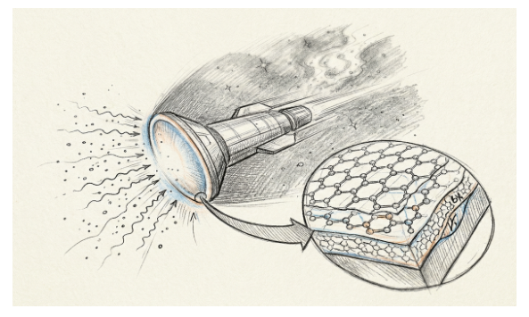
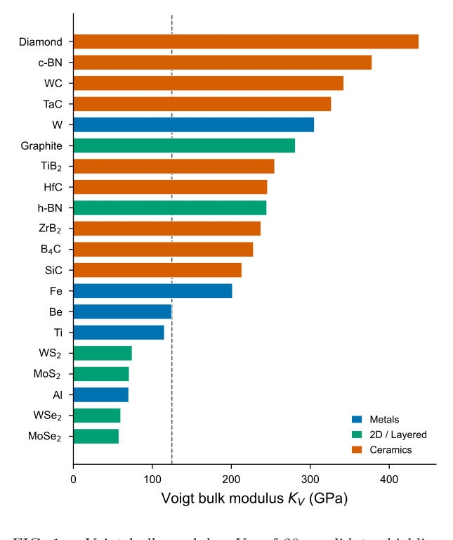
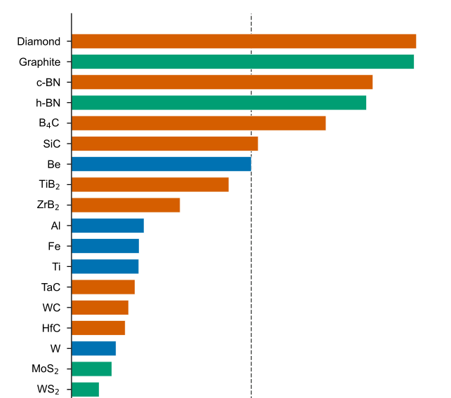
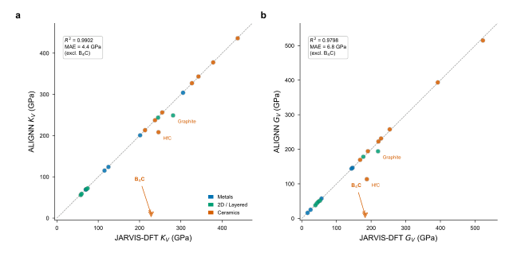

# Beyond Beryllium: AI-Accelerated Materials Discovery for Interstellar Spacecraft Shielding / 超越铍：AI 加速的星际航天器屏蔽材料发现

**原文链接**：[Beyond Beryllium: AI-Accelerated Materials Discovery for Interstellar Spacecraft Shielding](https://arxiv.org/abs/2604.00571)

**Yue Li∗,1 Xu Pan∗,2 and Kaiyuan Guo∗3**

**李悦∗,1 潘旭∗,2 郭开元∗,3**

1 School of Materials Science and Engineering, Nanyang Interstellar University, Singapore 639798, Singapore  
南洋星际大学材料科学与工程学院，新加坡 639798

2 School of Artificial Intelligence, Nanyang Interstellar University, Singapore 639798, Singapore  
南洋星际大学人工智能学院，新加坡 639798

3 Department of Medical Radiation Management and Hibernation, Shanghai Interstellar Jiao Tong University, Shanghai 200240, China  
上海星际交通大学医疗辐射管理与休眠系，上海 200240，中国

*(Dated: April 1, 2026 / 日期：2026 年 4 月 1 日)*

## Abstract / 摘要

Project Daedalus (1973–1978), the most detailed interstellar probe design study ever conducted, specified a 9 mm beryllium erosion shield to protect the spacecraft payload during its 5.9 light-year cruise to Barnard's Star at 12% of the speed of light. This design, however, predated both the isolation of two-dimensional materials and the development of graph neural network (GNN) property predictors. Here, we systematically screen 20 candidate materials—spanning conventional aerospace metals, transition metal dichalcogenides, and ultra-high-temperature ceramics—using density functional theory (DFT) data from the JARVIS database (76,000 materials) with independent validation by the Atomistic Line Graph Neural Network (ALIGNN). We evaluate candidates across four criteria: specific mechanical stiffness (KV/ρ), sputtering resistance, thermal neutron absorption cross-section, and thermodynamic stability. Our screening identifies hexagonal boron nitride (h-BN) and boron carbide (B4C) as dual-function materials offering simultaneous mechanical protection and neutron radiation shielding, and we propose a graphene/h-BN/polymer layered heterostructure shield design that achieves an estimated 47% mass reduction relative to the original beryllium specification. These findings will become immediately actionable upon the successful development of fusion pulse propulsion, which we note remains an outstanding engineering challenge.

代达罗斯计划（1973–1978）是有史以来最详尽的星际探测器设计研究，规定采用 9 mm 铍侵蚀屏蔽层，在以光速 12% 的速度巡航 5.9 光年至巴纳德星的过程中保护航天器有效载荷。然而，该设计早于二维材料的分离发现以及图神经网络（GNN）性质预测器的开发。在此，我们利用 JARVIS 数据库（76,000 种材料）的密度泛函理论（DFT）数据，并以原子线图神经网络（ALIGNN）独立验证，系统筛选 20 种候选材料——涵盖常规航空航天金属、过渡金属二硫化物及超高温陶瓷。我们依据四项标准评估候选材料：比机械刚度（KV/ρ）、抗溅射性、热中子吸收截面及热力学稳定性。筛选结果表明，六方氮化硼（h-BN）和碳化硼（B4C）是兼具机械防护与中子辐射屏蔽双重功能的材料；我们提出石墨烯/h-BN/聚合物层状异质结构屏蔽设计，相较原始铍方案估计可减轻 47% 的质量。这些发现将在聚变脉冲推进成功开发后立即具有可操作性——我们指出，后者仍是一项悬而未决的工程挑战。

> [!stat] **47% mass reduction / 质量减轻 47%**
> Estimated reduction relative to the original 9 mm beryllium Daedalus shield specification.
> 相较原始 9 mm 铍代达罗斯屏蔽规格估计的质量减轻幅度。

## Introduction / 引言

The prospect of interstellar travel has motivated some of the most ambitious engineering studies in human history. In 1968, Dyson [1] articulated the fundamental energetics of interstellar transport, establishing that nuclear pulse propulsion could in principle accelerate a spacecraft to a significant fraction of the speed of light. Project Orion (1958–1965) explored nuclear pulse propulsion using fission bombs before being curtailed by the Partial Test Ban Treaty [2]. The most comprehensive design study to date, Project Daedalus (1973–1978), proposed an unmanned probe propelled by inertial confinement fusion to reach Barnard's Star, 5.9 light-years distant, at a cruise velocity of 0.12c [3]. More recently, Project Icarus has sought to update the Daedalus concept with modern engineering knowledge [4].

星际旅行的前景激发了人类历史上一些最雄心勃勃的工程研究。1968 年，Dyson [1] 阐述了星际运输的基本能量学，确立了核脉冲推进原则上可将航天器加速至光速的显著比例。猎户座计划（1958–1965）在部分禁核试条约 [2] 叫停之前探索了利用裂变弹的核脉冲推进。迄今为止最全面的设计研究——代达罗斯计划（1973–1978）——提出以惯性约束聚变驱动的无人探测器，以 0.12c 的巡航速度抵达 5.9 光年外的巴纳德星 [3]。近年来，伊卡洛斯计划试图以现代工程知识更新代达罗斯概念 [4]。

A critical and often underappreciated challenge of relativistic spaceflight is the bombardment of the spacecraft by interstellar medium (ISM) particles. At 0.12c (3.6 × 10⁷ m/s), even the tenuous ISM becomes a formidable particle beam. Martin's analysis for the Daedalus study [5] showed that over a 5.9 light-year transit through a region with particle density n ≈ 1 cm⁻³, the frontal shield (area A ≈ 491 m²) would encounter ∼2.7 × 10²⁵ particles, with individual protons carrying kinetic energies of ∼6.7 MeV—well into the nuclear reaction regime. Larger dust grains, though far rarer, can deliver megajoule-scale impacts equivalent to macroscopic explosions [6, 7].

相对论航天中一个关键且常被低估的挑战，是航天器遭受星际介质（ISM）粒子轰击。在 0.12c（3.6 × 10⁷ m/s）下，即便稀薄的 ISM 也会成为可怕的粒子束。Martin 对代达罗斯研究的分析 [5] 表明，在粒子数密度 n ≈ 1 cm⁻³ 的区域穿越 5.9 光年，正面屏蔽（面积 A ≈ 491 m²）将遭遇约 2.7 × 10²⁵ 个粒子，单个质子动能约 6.7 MeV——已进入核反应能区。较大尘粒虽极为稀少，却可产生兆焦耳量级的撞击，等效于宏观爆炸 [6, 7]。

The Daedalus team's solution was a 9 mm beryllium erosion shield, selected for its combination of low density (ρ = 1.85 g/cm³), reasonable bulk modulus (KV ≈ 115 GPa), and high sublimation energy (Esb = 3.36 eV/atom) [3, 5]. However, this design was constrained to the materials knowledge of the 1970s. In the intervening half-century, materials science has undergone transformative advances: the isolation and characterization of two-dimensional materials beginning with graphene in 2004 [8]; the development of ultra-high-temperature ceramics (UHTCs) with extreme mechanical properties [9]; and the discovery that boron-containing materials provide exceptional neutron radiation shielding [10–13].

代达罗斯团队的方案是 9 mm 铍侵蚀屏蔽层，因其兼具低密度（ρ = 1.85 g/cm³）、合理体积模量（KV ≈ 115 GPa）和高升华能（Esb = 3.36 eV/atom）而被选中 [3, 5]。然而，该设计受限于 1970 年代的材料认知。此后半个世纪，材料科学经历了变革性进展：自 2004 年石墨烯以来二维材料的分离与表征 [8]；具有极端力学性能的超高温陶瓷（UHTC）的发展 [9]；以及含硼材料可提供卓越中子辐射屏蔽的发现 [10–13]。

Equally transformative has been the rise of computational materials screening. The JARVIS (Joint Automated Repository for Various Integrated Simulations) database now contains density functional theory (DFT) calculations for over 76,000 materials [14], while graph neural network architectures such as the Atomistic Line Graph Neural Network (ALIGNN) enable rapid property prediction with near-DFT accuracy [15–17]. In this work, we leverage the JARVIS-DFT database and ALIGNN pretrained models to systematically re-evaluate the materials selection for interstellar dust shielding. We screen 20 candidate materials across three families—conventional aerospace metals, layered/two-dimensional materials, and ceramics/superhard compounds—against four performance metrics relevant to the Daedalus mission profile. We identify several materials that substantially outperform beryllium, propose a layered heterostructure shield concept, and discuss the implications for future interstellar mission design.

计算材料筛选的兴起同样具有变革意义。JARVIS（联合自动化多集成模拟仓库）数据库现含逾 76,000 种材料的密度泛函理论（DFT）计算 [14]，而原子线图神经网络（ALIGNN）等图神经网络架构可实现接近 DFT 精度的快速性质预测 [15–17]。本工作利用 JARVIS-DFT 数据库与 ALIGNN 预训练模型，系统重新评估星际尘埃屏蔽的材料选择。我们在三类材料族——常规航空航天金属、层状/二维材料、陶瓷/超硬化合物——中筛选 20 种候选材料，对照与代达罗斯任务剖面相关的四项性能指标。我们识别出多种显著优于铍的材料，提出层状异质结构屏蔽概念，并讨论对未来星际任务设计的启示。

## Methods / 方法

### Mission Parameters / 任务参数

We adopt the Daedalus Phase 2 mission profile [3]: cruise velocity v = 0.12c = 3.6 × 10⁷ m/s, distance to Barnard's Star d = 5.9 ly = 5.58 × 10¹⁶ m, yielding a cruise time of ∼49 years. The shield is modeled as a circular disk of radius R = 12.5 m (matching the Daedalus second stage diameter of 25 m), giving a frontal area A = πR² ≈ 491 m². The local ISM is modeled with particle number density n = 1 cm⁻³ (= 10⁶ m⁻³) and mean particle mass m̄ = 1.29 amu, appropriate for a hydrogen-dominated medium with ∼10% helium by number. The total fluence on the shield surface over the mission is:

我们采用代达罗斯第二阶段任务剖面 [3]：巡航速度 v = 0.12c = 3.6 × 10⁷ m/s，至巴纳德星距离 d = 5.9 ly = 5.58 × 10¹⁶ m，巡航时间约 49 年。屏蔽建模为半径 R = 12.5 m 的圆盘（与代达罗斯二级直径 25 m 一致），正面面积 A = πR² ≈ 491 m²。局域 ISM 建模为粒子数密度 n = 1 cm⁻³（= 10⁶ m⁻³）、平均粒子质量 m̄ = 1.29 amu，适用于氢主导、氦数分数约 10% 的介质。任务期间屏蔽表面总通量为：

**Φ = n · d = 5.58 × 10¹⁸ particles/cm²** (1)

At 0.12c, the kinetic energy of a single proton is Ep = ½mpv² ≈ 6.7 MeV (non-relativistic approximation; the Lorentz factor γ = 1.0072 introduces a <1% correction). This energy substantially exceeds typical sputtering thresholds (∼10–100 eV) and surface binding energies (∼3–9 eV), placing the bombardment firmly in the high-energy sputtering regime.

在 0.12c 下，单质子动能 Ep = ½mpv² ≈ 6.7 MeV（非相对论近似；洛伦兹因子 γ = 1.0072 引入 <1% 修正）。该能量远超典型溅射阈值（约 10–100 eV）和表面结合能（约 3–9 eV），轰击明确处于高能溅射区。

### Material Screening Criteria / 材料筛选标准

We evaluate each candidate material against four criteria:

我们依据四项标准评估各候选材料：

**(i) Specific mechanical stiffness**, quantified by the ratio KV/ρ (GPa·cm³/g), where KV is the Voigt bulk modulus and ρ is the mass density. This metric captures the ability to resist mechanical deformation per unit mass—critical for minimizing shield mass while maintaining structural integrity under impact loading. We note that the Voigt average represents an upper bound on the true polycrystalline bulk modulus; for highly anisotropic layered materials (graphite, h-BN), this average includes the very stiff in-plane elastic constants and thus substantially exceeds the soft out-of-plane response. The Reuss (lower) bound for these materials would be significantly lower. Both bounds are reported where relevant.

**(i) 比机械刚度**，以 KV/ρ（GPa·cm³/g）量化，KV 为 Voigt 体积模量，ρ 为质量密度。该指标表征单位质量抗机械变形能力——在冲击载荷下保持结构完整性的同时最小化屏蔽质量至关重要。需注意 Voigt 平均代表真实多晶体积模量的上界；对高度各向异性的层状材料（石墨、h-BN），该平均包含极硬的面内弹性常数，因而显著超过软的面外响应。这些材料的 Reuss（下界）会低得多。相关处均报告两界。

**(ii) Sputtering resistance**, parameterized by the surface binding energy Esb (eV/atom). In the high-energy limit relevant to 0.12c bombardment, the sputtering yield scales approximately as Y ∝ 1/Esb [18]. We employ a simplified model:

**(ii) 抗溅射性**，以表面结合能 Esb（eV/atom）参数化。在 0.12c 轰击相关的高能极限下，溅射产额近似满足 Y ∝ 1/Esb [18]。采用简化模型：

**Y = Yref · Eref/Esb** (2)

with Yref = 3 atoms/ion at Eref = 4 eV, consistent with the high-energy limiting behavior reported for metallic targets [18].

其中 Yref = 3 atoms/ion，Eref = 4 eV，与金属靶材报道的高能极限行为一致 [18]。

**(iii) Thermal neutron absorption cross-section** σa (barns). While the primary ISM bombardment consists of fast particles, secondary neutron production within the shield itself, combined with the galactic cosmic ray background, makes neutron moderation an important secondary consideration. Materials containing boron-10 (σa = 3,840 barns) offer a dramatic advantage [10].

**(iii) 热中子吸收截面** σa（靶恩）。虽然主要 ISM 轰击为快粒子，屏蔽体内次级中子产生与银河宇宙线背景结合，使中子慢化成为重要的次要考量。含硼-10 的材料（σa = 3,840 barns）具有显著优势 [10]。

**(iv) Thermodynamic stability**, assessed via the energy above the convex hull (Ehull) from DFT calculations.

**(iv) 热力学稳定性**，通过 DFT 计算的凸包上方能量（Ehull）评估。

### Material Data Sources / 材料数据来源

Elastic moduli (KV, GV), formation energies, and band gaps were obtained from the JARVIS-DFT database [14, 17], which provides DFT-computed properties using the OptB88vdW functional for over 76,000 materials. Each material is identified by a unique JVASP identifier (Table II), enabling full reproducibility. Thermal neutron cross-sections were taken from the NNDC/IAEA Nuclear Data compilation [19]. Surface binding energies were obtained from experimental sublimation enthalpy data. As an independent validation, we performed property predictions using the ALIGNN pretrained models [15] on the same crystal structures retrieved from JARVIS. We note that beryllium is represented in the JARVIS database by its bcc phase (JVASP-14628, Im̄3m), as the ground-state hcp phase lacks computed elastic tensor data in the current release.

弹性模量（KV、GV）、形成能与带隙取自 JARVIS-DFT 数据库 [14, 17]，该库以 OptB88vdW 泛函对逾 76,000 种材料提供 DFT 计算性质。每种材料以唯一 JVASP 标识符（表 II）标识，确保完全可复现。热中子截面取自 NNDC/IAEA 核数据汇编 [19]。表面结合能取自实验升华焓数据。作为独立验证，我们对自 JARVIS 检索的相同晶体结构使用 ALIGNN 预训练模型 [15] 进行性质预测。需注意 JARVIS 中铍以其 bcc 相（JVASP-14628，Im̄3m）表示，因基态 hcp 相在当前版本中缺乏弹性张量计算数据。

### Composite Figure of Merit / 综合品质因数

To enable single-metric ranking, we define a shield figure of merit:

为支持单指标排序，定义屏蔽品质因数：

**FoM = (KV/ρ) · Esb · (1 + log₁₀(σa + 1))** (3)

normalized such that Be = 1.0. This weighting treats mechanical performance, sputtering resistance, and neutron absorption as multiplicatively complementary properties. We note that different mission architectures may warrant alternative weightings.

归一化使 Be = 1.0。该加权将力学性能、抗溅射性与中子吸收视为乘法互补性质。不同任务架构可能需要替代加权。

## Results / 结果

### Mechanical Properties / 力学性能

Figure 1 presents the Voigt bulk modulus KV and Fig. 2 the specific modulus KV/ρ for all 20 candidate materials. Among the ceramics, diamond (KV = 437 GPa, JVASP-91), cubic boron nitride (c-BN, 378 GPa, JVASP-7836), tungsten carbide (WC, 342 GPa), and tantalum carbide (TaC, 327 GPa) exhibit the highest absolute stiffness. When normalized by density, diamond and graphite (KV/ρ ≈ 125 GPa·cm³/g) dominate, followed by c-BN (109), h-BN (107), and B4C (92).

图 1 给出 Voigt 体积模量 KV，图 2 给出 20 种候选材料的比模量 KV/ρ。陶瓷中，金刚石（KV = 437 GPa，JVASP-91）、立方氮化硼（c-BN，378 GPa，JVASP-7836）、碳化钨（WC，342 GPa）和碳化钽（TaC，327 GPa）绝对刚度最高。按密度归一化后，金刚石与石墨（KV/ρ ≈ 125 GPa·cm³/g）居首，其次为 c-BN（109）、h-BN（107）和 B4C（92）。

An important caveat applies to the layered materials. The JARVIS-DFT Voigt bulk moduli for graphite (KV = 281 GPa, JVASP-48) and h-BN (KV = 245 GPa, JVASP-62756) are substantially higher than the ∼30–40 GPa values commonly cited in the literature. This discrepancy arises because the Voigt average is an upper bound that heavily weights the extremely stiff in-plane elastic constants (C11 > 1,000 GPa for graphene) while the interlayer response (C33 ∼ 30–40 GPa) contributes less. The Reuss (lower) bound for these materials would be closer to the commonly cited values. For the shielding application considered here, the in-plane stiffness is arguably the more relevant metric, as dust grain impacts would load the shield primarily in-plane. The layered transition metal dichalcogenides (MoS₂, WS₂, MoSe₂, WSe₂) exhibit uniformly low specific moduli (<15 GPa·cm³/g), rendering them unsuitable as primary structural shielding materials.

层状材料有一个重要注意事项。JARVIS-DFT 给出的石墨（KV = 281 GPa，JVASP-48）和 h-BN（KV = 245 GPa，JVASP-62756）Voigt 体积模量显著高于文献常见的约 30–40 GPa。差异源于 Voigt 平均作为上界，大幅加权极硬的面内弹性常数（石墨烯 C11 > 1,000 GPa），而层间响应（C33 ∼ 30–40 GPa）贡献较小。这些材料的 Reuss（下界）会更接近常见值。对本屏蔽应用，面内刚度可能更具物理意义，因尘粒撞击主要面内加载。层状过渡金属二硫化物（MoS₂、WS₂、MoSe₂、WSe₂）比模量普遍偏低（<15 GPa·cm³/g），不适合作为主要结构屏蔽材料。

### Shield Mass Analysis / 屏蔽质量分析

Figure 3 presents the erosion-adjusted shield mass for each material, computed by scaling the Daedalus reference thickness (9 mm) inversely with surface binding energy relative to beryllium (EBe sb = 3.36 eV), with a minimum structural thickness of 1 mm. The Daedalus beryllium erosion plate at 9 mm thickness serves as the baseline at 8.5 metric tons.

图 3 给出各材料的侵蚀修正屏蔽质量，将代达罗斯参考厚度（9 mm）按相对铍的表面结合能（EBe sb = 3.36 eV）反比缩放，最小结构厚度 1 mm。9 mm 厚的代达罗斯铍侵蚀板为基准，8.5 公吨。

Several materials achieve significant mass reductions relative to beryllium: graphite (4.5 t, −47%), B4C (6.4 t, −24%), h-BN (6.6 t, −22%), and diamond (7.0 t, −17%). The color encoding in Fig. 3 reveals that h-BN and B4C simultaneously provide exceptional neutron absorption (σa > 380 barns per atom), a capability entirely absent from the beryllium baseline (σa = 0.008 barns). At the other extreme, high-Z materials such as tungsten carbide (32.8 t), tungsten (31.5 t), and tantalum carbide (29.3 t) are unsuitable despite their excellent absolute mechanical properties, as their high densities translate to prohibitive shield masses.

多种材料相对铍显著减重：石墨（4.5 t，−47%）、B4C（6.4 t，−24%）、h-BN（6.6 t，−22%）、金刚石（7.0 t，−17%）。图 3 颜色编码显示 h-BN 与 B4C 同时提供卓越中子吸收（σa > 380 barns/atom），而铍基准完全不具备（σa = 0.008 barns）。另一端，碳化钨（32.8 t）、钨（31.5 t）、碳化钽（29.3 t）等高原子序数材料尽管绝对力学性能优异，因高密度导致屏蔽质量过大而不适用。

### Multi-Objective Screening / 多目标筛选

Figure 4 presents the two most critical performance axes—specific modulus versus thermal neutron absorption—as a scatter plot with point size proportional to surface binding energy. The Pareto front reveals three distinct high-performance regimes: (i) Pure mechanical excellence: diamond and graphite, with KV/ρ ≈ 125 but negligible neutron absorption. (ii) Balanced performance: B4C (KV/ρ = 92, σa = 614 barns), c-BN and h-BN (KV/ρ ≈ 107–109, σa = 384 barns), and TiB₂ (KV/ρ = 57, σa = 513 barns), combining strong mechanical properties with very high neutron absorption via their boron content. (iii) Radiation shielding specialists: ZrB₂ (σa = 511 barns) at moderate specific modulus. Beryllium occupies a poor position in this space: moderate specific modulus (65) with essentially zero neutron absorption. Its selection in 1978 reflects the limited material options available, not optimization against modern multi-objective criteria.

图 4 以比模量对热中子吸收为两关键性能轴作散点图，点大小正比于表面结合能。帕累托前沿揭示三类高性能区：(i) 纯力学卓越：金刚石与石墨，KV/ρ ≈ 125 但中子吸收可忽略。(ii) 均衡性能：B4C（KV/ρ = 92，σa = 614 barns）、c-BN 与 h-BN（KV/ρ ≈ 107–109，σa = 384 barns）、TiB₂（KV/ρ = 57，σa = 513 barns），以硼含量结合强力学与高吸收。(iii) 辐射屏蔽专才：ZrB₂（σa = 511 barns）中等比模量。铍在此空间位置不佳：中等比模量（65）且中子吸收近零。1978 年选中它反映当时材料选项有限，而非按现代多目标准则优化。

### ALIGNN Validation / ALIGNN 验证

Figure 5 presents parity plots comparing ALIGNN predictions with JARVIS-DFT values for bulk modulus KV and shear modulus GV. Excluding B4C, the agreement is excellent: R² = 0.990 and MAE = 4.4 GPa for KV; R² = 0.980 and MAE = 6.8 GPa for GV. The B4C outlier (JVASP-52866; ALIGNN predicts KV = 9 GPa versus DFT KV = 228 GPa) is attributed to the structural complexity of the rhombohedral B₁₂C₃ unit cell (15 atoms, R̄3m), which contains icosahedral B₁₂ clusters linked by C–B–C chains. This topology is rare in the ALIGNN training set, and the resulting graph representation may inadequately capture the inter-cluster bonding that governs the bulk elastic response.

图 5 为 ALIGNN 预测与 JARVIS-DFT 体积模量 KV、剪切模量 GV 的 parity 图。排除 B4C 后一致性极佳：KV 的 R² = 0.990、MAE = 4.4 GPa；GV 的 R² = 0.980、MAE = 6.8 GPa。B4C 离群点（JVASP-52866；ALIGNN 预测 KV = 9 GPa，DFT 为 228 GPa）归因于菱方 B₁₂C₃ 单胞（15 原子，R̄3m）的结构复杂性，其中二十面体 B₁₂ 簇由 C–B–C 链连接。该拓扑在 ALIGNN 训练集中罕见，所得图表示可能不足以刻画控制整体弹性响应的簇间键合。

> [!stat] **R² = 0.990 / 决定系数 R² = 0.990**
> ALIGNN bulk modulus prediction accuracy vs. JARVIS-DFT (excluding B4C outlier).
> ALIGNN 体积模量预测相对 JARVIS-DFT 的精度（排除 B4C 离群点）。

### Layered Heterostructure Shield Concept / 层状异质结构屏蔽概念

Based on our screening results, we propose a functionally graded layered shield (Fig. 6) in which each layer addresses a specific threat:

基于筛选结果，我们提出功能梯度层状屏蔽（图 6），各层应对特定威胁：

- **Layer 1: Graphene/graphite impact layer (∼50 µm).** The outermost layer exploits the extraordinary specific modulus of sp² carbon (KV/ρ = 124 GPa·cm³/g) and high sublimation energy (7.43 eV/atom) to absorb initial dust grain impacts and resist sputtering erosion.

- **第 1 层：石墨烯/石墨冲击层（约 50 µm）。** 最外层利用 sp² 碳的卓越比模量（KV/ρ = 124 GPa·cm³/g）和高升华能（7.43 eV/atom）吸收初始尘粒撞击并抗溅射侵蚀。

- **Layer 2: h-BN neutron absorber (∼2 mm).** Hexagonal boron nitride serves dual duty: its boron-10 content (σa = 3,840 barns for ¹⁰B) efficiently captures secondary thermal neutrons, while its high Voigt bulk modulus (KV = 245 GPa) provides mechanical reinforcement. NASA has independently validated BN-based materials for space radiation shielding [10, 12, 20].

- **第 2 层：h-BN 中子吸收层（约 2 mm）。** 六方氮化硼双重作用：硼-10 含量（¹⁰B 的 σa = 3,840 barns）高效俘获次级热中子，高 Voigt 体积模量（KV = 245 GPa）提供机械增强。NASA 已独立验证 BN 基材料用于空间辐射屏蔽 [10, 12, 20]。

- **Layer 3: HDPE cosmic ray moderator (∼5 mm).** High-density polyethylene, with its high hydrogen content, serves as a proton moderator for secondary cosmic ray particles, following established spacecraft shielding practice.

- **第 3 层：HDPE 宇宙线慢化层（约 5 mm）。** 高密度聚乙烯以高氢含量作为次级宇宙线质子的慢化体，遵循既有航天器屏蔽实践。

- **Layer 4: Aluminum structural support (∼1 mm).** A conventional aluminum backing provides structural mounting and thermal management.

- **第 4 层：铝结构支撑层（约 1 mm）。** 常规铝背板提供结构安装与热管理。

The total heterostructure thickness of ∼8 mm is comparable to the original 9 mm beryllium design, but the estimated total mass of ∼4.5 metric tons represents a 47% reduction from the 8.5-ton beryllium baseline, while adding neutron absorption capability entirely absent from the original.

异质结构总厚度约 8 mm，与原始 9 mm 铍设计相当，但估计总质量约 4.5 公吨，较 8.5 吨铍基准减轻 47%，同时增加原始方案完全不具备的中子吸收能力。

### Figure of Merit Ranking / 品质因数排序

Table I presents the composite figure of merit for the top 10 candidates. The top-ranked materials—c-BN (FoM = 9.2), B4C (9.1), h-BN (9.0), and TiB₂ (6.3)—all contain boron, reflecting the outsized contribution of neutron absorption to overall shielding performance. Diamond and graphite rank next (FoM ≈ 4.2) on the strength of their unmatched specific moduli alone. The original Daedalus beryllium (FoM ≡ 1.0) is outperformed by 13 of 20 candidates, suggesting that the 1978 material selection was, charitably, suboptimal by modern standards.

表 I 给出前 10 名候选材料的综合品质因数。排名前列——c-BN（FoM = 9.2）、B4C（9.1）、h-BN（9.0）、TiB₂（6.3）——均含硼，反映中子吸收对整体屏蔽性能的超大贡献。金刚石与石墨次之（FoM ≈ 4.2），仅凭无与伦比的比模量。原始代达罗斯铍（FoM ≡ 1.0）被 20 种候选中的 13 种超越，表明 1978 年材料选择在现代标准下——客气地说——并非最优。

**TABLE I. Top 10 candidate materials ranked by composite figure of merit, normalized to Be = 1.0. / 表 I. 按综合品质因数排序的前 10 种候选材料，归一化至 Be = 1.0。**

| Material 材料 | KV/ρ | σa (b) | Esb (eV) | Mass (t) 质量 (t) | FoM |
| --- | --- | --- | --- | --- | --- |
| c-BN 立方氮化硼 | 109.2 | 384 | 5.18 | 9.9 | 9.2 |
| B₄C 碳化硼 | 92.2 | 614 | 5.70 | 6.4 | 9.1 |
| h-BN 六方氮化硼 | 106.9 | 384 | 5.18 | 6.6 | 9.0 |
| TiB₂ 二硼化钛 | 57.0 | 513 | 6.50 | 10.2 | 6.3 |
| Diamond 金刚石 | 125.0 | 0.004 | 7.43 | 7.0 | 4.2 |
| Graphite 石墨 | 124.1 | 0.004 | 7.43 | 4.5 | 4.2 |
| ZrB₂ 二硼化锆 | 39.4 | 511 | 6.30 | 14.2 | 4.2 |
| SiC 碳化硅 | 67.6 | 0.09 | 6.22 | 7.5 | 2.0 |
| HfC 碳化铪 | 19.5 | 52 | 6.80 | 27.5 | 1.6 |
| TaC 碳化钽 | 23.0 | 10 | 7.20 | 29.3 | 1.5 |

## Discussion / 讨论

Our screening reveals a striking finding: hexagonal boron nitride, a material whose radiation shielding properties have been extensively validated by NASA for low-Earth orbit applications [10–13], has apparently never been considered for interstellar shielding. This oversight is historically understandable—h-BN was not available in bulk form in 1978—but it represents a factor-of-48,000 improvement in neutron absorption cross-section over beryllium (384 vs. 0.008 barns per atom). The boride ceramics B4C and TiB₂ emerge as the strongest overall candidates when all metrics are weighted equally. B4C is already used in nuclear reactor control rods and neutron shielding precisely because of its boron content, high hardness, and low density—the same properties that make it attractive for interstellar shielding.

我们的筛选揭示一个惊人发现：六方氮化硼——其辐射屏蔽性能已被 NASA 在低地球轨道应用中广泛验证 [10–13]——显然从未被考虑用于星际屏蔽。这一疏漏历史上可以理解——1978 年 h-BN 尚无块体形式——但它相对铍的中子吸收截面提升约 48,000 倍（384 对 0.008 barns/atom）。当所有指标等权时，硼化物陶瓷 B4C 与 TiB₂ 成为最强综合候选。B4C 已用于核反应堆控制棒与中子屏蔽，正因其硼含量、高硬度和低密度——同样使其对星际屏蔽具吸引力的性质。

A notable result of this study is the high Voigt bulk moduli obtained for layered materials from JARVIS-DFT: 281 GPa for graphite and 245 GPa for h-BN. These values reflect the Voigt (upper bound) averaging of highly anisotropic elastic tensors, in which the extraordinary in-plane stiffness dominates. The Reuss (lower) bound, which would be more appropriate for estimating out-of-plane compressive response, yields values closer to the commonly cited ∼30–40 GPa. For the in-plane impact loading relevant to dust shielding, the Voigt average may in fact be the more physically meaningful metric.

本研究一个值得注意的结果是 JARVIS-DFT 给出的层状材料高 Voigt 体积模量：石墨 281 GPa、h-BN 245 GPa。这些值反映高度各向异性弹性张量的 Voigt（上界）平均，其中卓越面内刚度占主导。Reuss（下界）更适合估计面外压缩响应，给出更接近常见约 30–40 GPa 的值。对尘埃屏蔽相关的面内冲击载荷，Voigt 平均事实上可能是更有物理意义的指标。

Several limitations warrant discussion:

若干局限性值得讨论：

**Temperature effects.** Our screening uses room-temperature DFT elastic moduli. At the ∼3 K ambient temperature of interstellar space, most ceramics will be harder and more brittle, while the sputtering physics may differ from room-temperature models.

**温度效应。** 筛选使用室温 DFT 弹性模量。在星际空间约 3 K 环境温度下，多数陶瓷更硬更脆，溅射物理也可能与室温模型不同。

**Radiation damage accumulation.** We treat sputtering as a surface phenomenon, neglecting bulk radiation damage (displacement cascades, amorphization) that will degrade mechanical properties over the 49-year mission duration [7].

**辐射损伤累积。** 我们将溅射视为表面现象，忽略 49 年任务期间会降低力学性能的整体辐射损伤（位移级联、非晶化）[7]。

**ALIGNN limitations.** The ALIGNN pretrained model fails dramatically for B4C (Fig. 5), predicting KV = 9 GPa versus the DFT value of 228 GPa. This failure highlights a known limitation of GNN-based property predictors for structurally complex materials with large, low-symmetry unit cells that are underrepresented in training data.

**ALIGNN 局限性。** ALIGNN 预训练模型对 B4C 严重失效（图 5），预测 KV = 9 GPa，DFT 为 228 GPa。这凸显基于 GNN 的性质预测器对训练数据中代表性不足、大低对称单胞结构复杂材料的已知局限。

**Manufacturing considerations.** Our analysis assumes that candidate materials can be fabricated into ∼500 m² shields of the required thickness. We note that manufacturing a 491 m² diamond shield remains an outstanding challenge.

**制造考量。** 分析假设候选材料可制成所需厚度的约 500 m² 屏蔽。制造 491 m² 金刚石屏蔽仍是突出挑战。

**Scope of applicability.** Our analysis assumes the existence of a spacecraft capable of reaching 0.12c, which we acknowledge has not yet been constructed. The primary bottleneck in implementing our recommendations is not materials selection but rather the development of a functioning fusion pulse drive—a challenge we leave to future work.

**适用范围。** 分析假设存在可达 0.12c 的航天器，我们承认尚未建成。落实建议的主要瓶颈不是材料选择，而是可工作的聚变脉冲驱动的开发——我们留待未来工作。

## Conclusion / 结论

We have performed a systematic computational screening of 20 candidate materials for interstellar dust shielding, using DFT-computed mechanical properties from the JARVIS database (76,000 materials) with independent validation by ALIGNN graph neural network predictions (R² = 0.990 for bulk modulus, excluding one outlier). Our analysis demonstrates that 48 years of materials science progress since Project Daedalus have yielded multiple candidates that substantially outperform the original beryllium shield specification. The most promising finding is the identification of boron-containing materials—particularly h-BN, B4C, and c-BN—as dual-function materials providing both mechanical protection and neutron radiation shielding. We propose a layered graphene/h-BN/HDPE/Al heterostructure that achieves a 47% mass reduction relative to the Daedalus beryllium design while adding neutron absorption capability entirely absent from the original.

我们对 20 种星际尘埃屏蔽候选材料进行了系统计算筛选，使用 JARVIS 数据库（76,000 种材料）的 DFT 力学性质，并以 ALIGNN 图神经网络预测独立验证（体积模量 R² = 0.990，排除一个离群点）。分析表明，代达罗斯计划以来 48 年的材料科学进展已产生多种显著优于原始铍屏蔽规格的候选。最有前景的发现是识别含硼材料——尤其 h-BN、B4C、c-BN——为兼具机械防护与中子辐射屏蔽的双重功能材料。我们提出石墨烯/h-BN/HDPE/Al 层状异质结构，相对代达罗斯铍设计减轻 47% 质量，同时增加原始方案完全不具备的中子吸收能力。

## Acknowledgments / 致谢

We acknowledge that this work was submitted on April 1, 2026. While the research question addressed herein is of limited immediate practical relevance—owing primarily to the nonexistence of the spacecraft under consideration—all data, computational methods, and physical models presented are genuine and fully reproducible. The JARVIS-DFT dataset identifiers (Table II) and ALIGNN pretrained model weights are publicly available, and we encourage skeptical readers to verify our results.

我们确认本工作提交于 2026 年 4 月 1 日。尽管所研究问题即时实用相关性有限——主要因为所涉航天器尚不存在——所呈现的数据、计算方法与物理模型均真实且完全可复现。JARVIS-DFT 数据集标识符（表 II）与 ALIGNN 预训练模型权重公开可用，我们鼓励持疑读者验证结果。

Y.L. and X.P. celebrate eight years of partnership since a fateful April Fools' Day in 2018, which began as a research excursion and proved considerably more consequential than either party anticipated. This paper is dedicated to that anniversary. Y.L. and K.G. raise a glass to a bro's birthday month—April has always been kind to us. The total computational cost of this study was approximately 2 CPU-hours, which represents roughly 10⁻¹⁰ of the estimated energy budget of the Daedalus spacecraft itself. We thank Freeman Dyson (1923–2020) for articulating the possibility of interstellar transport, and the British Interplanetary Society for the engineering audacity of Project Daedalus. May the Force be with you.

李悦与潘旭庆祝自 2018 年那个命运般的愚人节以来八年的合作，起初是一次研究出游，结果比双方预期的影响深远得多。本文献给该周年纪念。李悦与郭开元为兄弟的生日月举杯——四月对我们一向友善。本研究总计算成本约 2 CPU 小时，约为代达罗斯航天器估计能量预算的约 10⁻¹⁰。我们感谢 Freeman Dyson（1923–2020）阐述星际运输的可能性，以及英国星际学会在代达罗斯计划上的工程胆识。愿原力与你同在。

## References / 参考文献

**TABLE II. JARVIS-DFT identifiers and DFT-computed properties for all 20 screened materials. / 表 II. 全部 20 种筛选材料的 JARVIS-DFT 标识符与 DFT 计算性质。**

| Material 材料 | JVASP ID | KV | KV/ρ |
| --- | --- | --- | --- |
| Be* 铍* | JVASP-14628 | 124.7 | 65.1 |
| Al 铝 | JVASP-816 | 69.9 | 26.3 |
| Ti 钛 | JVASP-14815 | 115.2 | 24.4 |
| Fe 铁 | JVASP-882 | 201.4 | 24.5 |
| W 钨 | JVASP-14830 | 305.2 | 16.2 |
| Graphite 石墨 | JVASP-48 | 281.0 | 124.1 |
| Diamond 金刚石 | JVASP-91 | 437.4 | 125.0 |
| h-BN 六方氮化硼 | JVASP-62756 | 244.8 | 106.9 |
| c-BN 立方氮化硼 | JVASP-7836 | 378.2 | 109.2 |
| MoS₂ | JVASP-28733 | 70.6 | 14.6 |
| WS₂ | JVASP-72 | 74.3 | 10.0 |
| MoSe₂ | JVASP-57 | 57.6 | 8.6 |
| WSe₂ | JVASP-75 | 59.9 | 6.7 |
| B₄C 碳化硼 | JVASP-52866 | 228.0 | 92.2 |
| SiC 碳化硅 | JVASP-22633 | 213.2 | 67.6 |
| TiB₂ 二硼化钛 | JVASP-20096 | 254.8 | 57.0 |
| ZrB₂ 二硼化锆 | JVASP-19723 | 237.3 | 39.4 |
| HfC 碳化铪 | JVASP-17957 | 245.8 | 19.5 |
| TaC 碳化钽 | JVASP-20073 | 326.7 | 23.0 |
| WC 碳化钨 | JVASP-52591 | 342.5 | 20.7 |

*\*bcc phase; hcp Be lacks elastic data in JARVIS. / \*bcc 相；JARVIS 中 hcp 铍缺乏弹性数据。*

[1] F. J. Dyson, Interstellar transport, Physics Today 21, 41 (1968).  
[2] G. R. Schmidt, J. A. Bonometti, and P. J. Morton, Nuclear pulse propulsion — Orion and beyond, AIAA 2000-3856 (2000).  
[3] A. Bond and A. R. Martin, Project Daedalus — the final report on the BIS starship study, J. Brit. Interplanet. Soc. 31, S1 (1978).  
[4] K. F. Long and R. K. Obousy, Project Icarus: Son of Daedalus, J. Brit. Interplanet. Soc. 62, 403 (2009).  
[5] A. R. Martin, Project Daedalus: Bombardment by interstellar material, J. Brit. Interplanet. Soc. 31, S116 (1978).  
[6] K. F. Long et al., Calculations of particle bombardment, arXiv:2307.12160 (2023).  
[7] T. Hoang et al., The interaction of relativistic spacecrafts with the interstellar medium, Astrophys. J. 837, 5 (2017).  
[8] C. Lee et al., Measurement of the elastic properties of monolayer graphene, Science 321, 385 (2008).  
[9] W. G. Fahrenholtz et al., Refractory diborides of zirconium and hafnium, J. Am. Ceram. Soc. 90, 1347 (2007).  
[10] S. A. Thibeault et al., Radiation Shielding Materials Containing Hydrogen, Boron, and Nitrogen, NASA NIAC Phase I Final Report (2012).  
[11] C. Harrison et al., Polyethylene/boron nitride composites for space radiation shielding, J. Appl. Polym. Sci. 109, 2529 (2008).  
[12] T. Thomas et al., Foam with direction: anisotropic radiation shielding properties of 2D boron nitride nanoplatelet foams, npj 2D Mater. Appl. 8, 15 (2024).  
[13] Y.-K. Kim et al., High-density boron nitride nanotube composites for enhanced space radiation shielding, Adv. Funct. Mater. (2025).  
[14] K. Choudhary et al., The joint automated repository for various integrated simulations (JARVIS), npj Comput. Mater. 6, 173 (2020).  
[15] K. Choudhary and B. DeCost, Atomistic line graph neural network (ALIGNN), npj Comput. Mater. 7, 185 (2021).  
[16] K. Choudhary et al., Rapid prediction of phonon structure using ALIGNN, Phys. Rev. Mater. 7, 023803 (2023).  
[17] K. Choudhary et al., Elastic properties of bulk and low-dimensional materials, Phys. Rev. B 98, 014107 (2018).  
[18] J. Drobny et al., Survivability of metallic shields for relativistic spacecraft, J. Brit. Interplanet. Soc. 73, 446 (2020).  
[19] S. F. Mughabghab, Thermal Neutron Capture Cross Sections (IAEA, 2003).  
[20] I. Orikasa et al., Smart foams: Boron nitride–graphene nanoplatelet foams, Adv. Mater. Technol. 9, 2400106 (2024).

**Source / 来源:** [arXiv:2604.00571](https://arxiv.org/abs/2604.00571) · cond-mat.mtrl-sci · Submitted 1 Apr 2026
